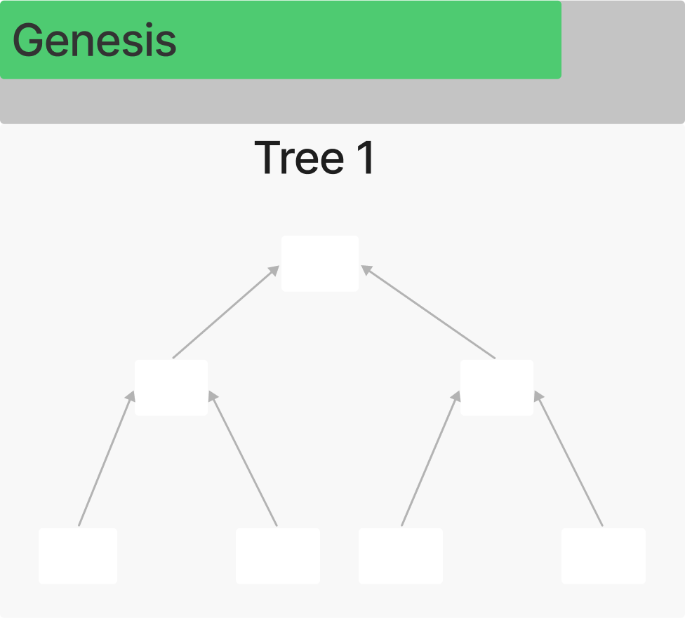

# Scan State

The **scan state** is a data structure used in Mina that allows to separate **block production** and **ZK-proof** between **validators** and **snark workers**. At that, the block production time remains constant regardless of the chain **throughput**. The scan state also makes it possible to parallelize snark work production.

The scan state represents a stack of **binary trees**, where each node in the tree is a snark job to be completed by a snark worker. The scan state periodically returns a single proof from the top of a tree that attests to the correctness of all transactions at the base of the tree. The scan state defines the number of transactions in a block. Currently, Mina allows 128 transactions to enter a block. A block producer, rather than completing the work themselves, may purchase the completed work from any snark workers from bids available in the snark pool. For more information on snark works, snarkers and ZK-proof mechanism, please, go to [ZK-proof Mechanism and ZK-snarks](zk-proof-mechanism-and-zk-snarks.md).

### Glossary Reference 1


**Binary tree** - a tree data structure in which each node has at most two children, which are referred to as the left child and the right child.

**Block production** - the process of producing blocks, which includes adding transactions to a block and recording them therein in a cryptographic manner, as well as gossipping network participants and adding a new block to the network.

**Scan state** - the data structure that queues transactions requiring transaction snark proofs and allows parallel processing of these transaction snarks by snark workers.

**Snarker/Snark worker** - a network node that provides ZK-proof (snark-work).

**Throughput** - the measure of how many transaction a blockchain is able to process within a given time frame.

**Validator (block producer)** - a node that maintains the integrity of the blockchain by constantly calculating the link from the first block to the last one and by approving new blocks created by block producers.

**ZK-proof (ZK-snark)** - a cryptographic method by which one party (a prover) can prove to another party (a verifier) that a given statement is true while the prover avoids conveying any additional information apart from the fact that the statement is indeed true.

See [Mina glossary](../mina-glossary.md).


The scan state has 2 basic constants that define its behavior: _**transaction\_capacity\_log\_2**_ that defines the maximum number of transactions that can be included in a block: and _**work\_delay**_ that ensures there is enough time for the snark work to be completed by the snark workers. If there are no completed proofs available, the block producer cannot include any transactions.

The maximum number of transactions in a block is defined by the following formula:

<strong>Formula 1: Maximum Number of Transactions</strong>

**Tmax=2^(TCL)**

where **Tmax** = maximum number of trees,

**TCL** = transaction\_capacity\_log\_2

The maximum number of trees is calculated by the following formula:

Formula 2: Maxium Number of Trees

**Tmax=(TCL+1)\*WD,**

where **Tmax** = maximum number of trees,

**TCL** = transaction\_capacity\_log\_2,

**WD** = work\_delay

The maximum number of proofs that may be included per block is defined by the following formula:

Formula 3: Maximum Number of Trees

**MNP = 2^(TN/TCL+1)-1,**

where **MNP** = max\_number\_of\_proofs,

**TN**= number of transactions,

**TCL** = transaction\_capacity\_log\_2

Here below is an example that helps to understand how the scan state works.

Let’s take a state scan with max\_no\_of\_transactions = 4 and work\_delay = 1. At **Genesis,** the scan state is empty and looks like in **Figure 1**.

### Figure 1 - Genesis

**Block 1**: A block producer includes four transactions into the scan state labeled (B1). These transactions fill the base of the first tree (see **Figure 2**).

### Figure 2 - Block 1

**Block 2**: At the second block, a block producer adds another four transactions (B2). These are added to a second tree, once again filling the base. There are no proofs required due to the work delay of 1 block (see **Figure 3**).

### Figure 3 - Block 2

**Block 3**: At the third block, a block producer adds four (B3) transactions to the third tree but must include four proofs for the first tree. As a result of including these completed base proofs, two new (M3) merge jobs are created (see **Figure 4**).

### Figure 4 - Block 3

For the fourth block, a block producer adds another four transactions (see **Figure 5**) to the base of the fourth tree. They must include four proofs corresponding to the work added in block 2. Again, two `M4` merge jobs are created as a result.

### Figure 5 - Block 4

**Block 5**: In the fifth block, another four transactions are included to fill the base of tree five (B5), and six proofs must be included (B3s and M3s). The M3 merge jobs result in a final pending merge job for the first tree (M5) (see **Figure 6**).

### Figure 6 - Block 5

**Block 6**: In the sixth block, another four transactions (B6) are added, filling the base of the sixth tree. Six proofs are included (B4 and M4), and three new merge jobs are created (M6) (see **Figure 7**).

### Figure 7 - Block 6

**Block 7**: In the seventh block, a further four transactions (B7) are added by the block producer filling the base of the seventh tree. Seven trees are the maximum number of trees according to the specified scan state constants. The maximum number of proofs (7) are included (B5 and M5). These included proofs create three new merge jobs (M7), and additionally, the top (M5) proof is emitted from the scan state. The proof that is emitted from the first tree is the ledger proof corresponding to the transactions added in block 1. The contents of the tree are then removed to create space for additional transactions, so the next tree will be empty (**Figure 8**).

### Figure 8 - Block 7

Newly added jobs to the scan state are pending jobs for snark workers to complete. Snark workers complete the required transaction Snarks, submitting bids for their completed work. When a node receives and validates the completed work, it will add to its local snark pool if it is valid and the lowest fee for the required work. The work will later be gossiped to other peers in the network. In the case where there is no completed snark work available to purchase in the order required, then the corresponding transactions will not be included in a block. This may result in an empty block, but also for the case where no transactions can be added (including a coinbase transaction), there will be no reward for the block producer.
