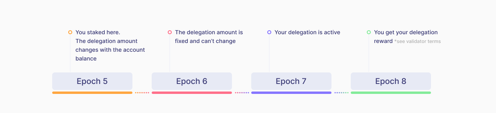

# Mina Staking

## Delegation Transaction 

If you don't run a node but want to stake, you can delegate your tokens to a validator. A **** delegation is a transaction, when a delegator, i.e. an account that doesn’t run a node and can’t stake Mina itself, delegates its tokens to a validator.

A delegation is not a transfer of tokens from one account to another - in fact, a transfer is another type of transaction. With a delegation delegator’s tokens remain on its account, but they are locked for the delegation period. A delegator may redelegate its funds to another validator or to the same validator again. After this there is a latency period of 2-4 weeks before your new stake delegation comes into effect.&#x20;

## Staking Lifecycle 

You don’t get your reward once you made your delegation. Overall, it takes over 2 or 3 epochs. This period includes:

1. 1-2 epochs until a delegation becomes active and starts to produce rewards (depending on when you made your delegation: if you made your delegation at the beginning of an epoch, this extends the waiting time, and if you did it at the end of an epoch, it will take less time);
2. next epoch the active delegation produces rewards;
3. the validator distributes rewards; it takes some time until your validator provides you your share of the rewards depending on its terms.&#x20;

<figure><figcaption></figcaption></figure>

## Delegation Specifics

At any point of the delegation lifecycle, a delegator may delegate funds to another validator. In Mina all account balance is delegated to only one validator. **You can’t delegate part of your balance and you can’t delegate to multiple validators.** If you’re a validator, you can validate to yourself.


Please note that if you did not stake to anyone, then after 2 epochs the **protocol will automatically stake your tokens** (starting from the moment when there is more than 1 Mina on the balance)



Also, you **cannot cancel the delegation** of your funds to Mina, since the developers of the protocol do not see the point in such an operation. Your funds are staked, and if you want to change the validator, you simply send a **new delegation**.


## Staking Rewards

**Validator** gets rewarded for staking accounts from coinbase (720 - for a regular block, 1440 - for a supercharged block) according to its share in the validator’s stake in the event the said validator wins block production (for more information please go to [**Mina Bock Production**](https://docs.staketab.com/academy/mina/mina-block-production)).

A **delegator** can receive its reward after its validator wins block production and produces its block. From the moment the block is won, the payout period depends entirely on the conditions of the validator. As a rule, the payout occurs at the beginning of the next epoch after the one when the reward was won by the validator. Sometimes it can happen in the same epoch, or vice versa, an epoch later.&#x20;


Mina does not regulate the validator-delegator relationship, so each validator sets its own payout schedule. You can see the **reward payment terms** [**here**](https://mina.staketab.com/mainnet/validators/terms?epoch=35\&isFullyUnlocked=false\&isNotAnonymous=true\&isVerifOnly=false\&isWithFee=true\&orderBy=DESC\&page=0\&searchStr=\&size=100\&sortBy=amount\_staked\&stake=1000\&type=active). Check the payment frequency to know how long it will take you to get your reward.



For more information on the reward accrual **** please see **** [**Mina Reward Calculation**](https://docs.staketab.com/academy/mina/mina-reward-calculation).

