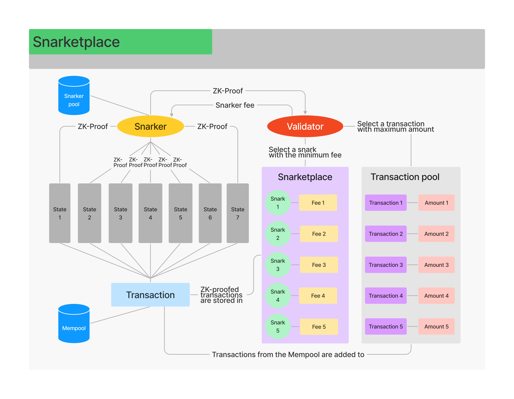

# ZK-proof mechanism and ZK-snarks

## What makes Mina so lightweight? 

Mina is a succinct and lightweight **PoS** blockchain that weighs only 22 kBytes and allows to run a **node** ever from an I-phone. This became possible due to the fact that, unlike in **PoW** protocols, where data storage, computation and **block production** are performed by all nodes, which requires a growing amount of CPU, in Mina, these roles are separated between archive nodes, **ZK-snarkers (snark-workers)** and **validators (block producers)** (see **Figure 1**). For more information on accounts in Mina, please, go to [Mina Accounts](mina-accounts.md).

### Glossary Reference 1


**Block production** - the process of producing blocks, which includes adding transactions to a block and recording them therein in a cryptographic manner, as well as gossipping network participants and adding a new block to the network.

**Node** - a device (such as a computer) that contains a copy of the blockchain's transaction history and maintains a blockchain.

**PoS** - a method of protection in cryptocurrencies, in which the probability of the formation of the next block in the blockchain by the participant is proportional to the share that the accounting units of this cryptocurrency belong to this participant from their total number.

**PoW** - a decentralized consensus mechanism that requires network members to make a CPU effort to solve an arbitrary mathematical puzzle so that no one can cheat the system.

**Snark (snark proof, ZK-proof, snark work)** - a cryptographic proof that allows one party to prove it possesses certain information without revealing that information.

**Validator (block producer)** - a node that maintains the integrity of the blockchain by constantly calculating the link from the first block to the last one and by approving new blocks created by block producers.

**ZK-proof** - **zero-knowledge proof** or **zero-knowledge protocol** is a method by which one party (a prover) can prove to another party (a verifier) that a given statement is true while the prover avoids conveying any additional information apart from the fact that the statement is indeed true.

**ZK-Snarker (snark worker)** - a network node that provides ZK proof (snark work).

See [Mina glossary](mina-glossary.md).


### Figure 1 - Separation of roles in Mina

Validators are **full nodes** that broadcast transactions and produce blocks. ZK-snarkers, on the other hand, are not full nodes, but they aren’t **light clients** either. ZK-snarkers are seen as a special type of nodes - **non-consensus nodes**, which are designed to have access to full historical information in the Mina blockchain and process these data for validators. To operate ZK-snarkers need 5 types of data in store:

1. **Verification key** - this is used for verifying the protocol state and a ZK proof.
2. **Protocol state** - a clear an unambiguous representation of the state of the network.
3. ZK-snark proof **** - an object we can verify if we have the verification key and the protocol state.
4. **Account** information.
5. **Merkle path** - a path of the account in the **Merkle tree** in Mina, which convinces a node that this account is part of the ledger (see **Figure 2**).

### Glossary Reference 2


**Account** - a personal profile for digital asset management and other operations in the Mina blockchain.

**Full node** - a Mina node that is able to verify the state of the network trustlessly. In Mina, every node is a full node since all nodes can receive and verify zk-SNARKs.

**Light client** - a node, a computer in the blockchain, that prefers to store only a subset of blocks and relies on full nodes for transactions that require the full blockchain and implements lightweight payment verification where block headers are downloaded during the initial synchronization and then requests transactions from full nodes as needed.

**Merkle tree** - data structure in which every node is labeled with the cryptographic hash of a data block, and every node that is not a leaf (called a _branch_, _inner node_, or _inode_) is labelled with the cryptographic hash of the labels of its child nodes.

**Merkle path** - the route to a particular node in a Merkle tree.

**Non-consensus node** - a full node in the Mina protocol that does not participate in consensus but can still fully verify the zero-knowledge proof to trustlessly validate the state of the chain.

**Protocol state** - a state of the network, including the previous hash of the protocol state for linking blocks together, and a body containing the hash of the genesis state, the blockchain state, the consensus state, and the consensus constants.

**Verification key** - a piece of encryption that is used for the execution of a smart contract.

See [Mina glossary](mina-glossary.md).


### Figure 2 - Merkle Tree

What allows decoupling the production of transaction SNARKs from block producers to snark workers is a specific data structure - the **scan state**. For more information on the scan state please go to [Scan State.](scan-state.md)

## ZK-proof mechanism 

Mina Protocol uses the Zero-Knowledge proof mechanism to prove the validity of transactions. This doesn't require nodes to maintain the full history of the blockchain like other **cryptocurrency** protocols. Unlike Bitcoin, where all nodes have to engage a lot of CPU to produce new blocks and approve **transactions**, in Mina this work is done by special nodes: ZK-snarkers or snark workers. In Mina protocol each block producer, when it proposes a new block to the network, must also include a zk-SNARK along with that block. The full name of SNARK stands for “succinct non-interactive argument of knowledge” - it is proof that a transaction is valid and its previous states have been checked and verified. Using ZK-proofs allows nodes to discard all historical data about transactions that have been finalized, and retain just the snark.

In Mina, those are ZK-snarkers that do snark works. What snarkers actually do is they tell validators that the original state of the transaction is valid when new blocks are produced. Literally, a snarker approves all previous states of a transaction and provides proof to a validator that the transaction is valid by showing a “snapshot“ of the first and the last states of the transaction (see **Figure 3**). An act of doing so is called a snark or a snark work. To do snark works a ZK-snark, unlike validators, needs to have a substantial CPU. In Mina Protocol 2 snark-works are enveloped in 1 snark job. ZK-snarks can be merged, and they are identical, regardless of the order merged (see **Figure 1**). This parallelism means that anybody can do snark works, and they will be the same.

### **Glossary Reference 3**


**Cryptocurrency** - a digitally distributed and traded currency for which proof of ownership is established using cryptographic methods.

**Scan state** - the data structure that queues transactions requiring transaction snark proofs and allows parallel processing of these transaction snarks by snark workers.

**Transaction** - a transfer of data from one block to another in a cryptographic manner that launches state transition.

See [Mina glossary](mina-glossary.md).


### Figure 3 - ZK-Proof Mechanism

## Snarketplace 

In Mina block producers are encouraged to participate in including transactions in a block through transaction fees and gaining block production reward, they are responsible for offsetting the transactions by purchasing an equal number of completed snark work, thereby creating demand for snark work. Snark workers, for their part, charge a fee from a validator for providing snark works. Some fees can equal zero, but normally this is a particular amount of nanoMina **** funds. To add a transaction in a block a validator chooses a transaction from the **mempool** with the highest amount and aims to select a snark work from the snark pool with the lowest fee. Validators use their block rewards to purchase snark work from snark workers. Validators and snark workers together, therefore, make up a market called **snarketplace**, where snark fees are balanced by the economic mechanism of demand and supply. For more information on Mina Protocol please go to [Mina Domain Model](mina-domain-model.md).

A **snark coordinator** coordinates snark jobs among many snark workers. The coordinator is responsible for sending new work to the snark workers, ensuring they do not duplicate the same work. The snark workers communicate with the snark coordinator via RPC calls. **Figure 4** shows the mechanism of ZK-proof in the Mina Protocol.

### Glossary Reference 4


**Mempool** - a cryptocurrency node mechanism for storing information about unconfirmed transactions that are awaiting confirmation - a database where new transactions are stored.

**Snark coordinator** - a system entity that coordinates the work of snarkers in snarketplace. It is responsible for sending new work to the snark workers, ensuring they do not duplicate the same work.

**Snarker fee** - a fee for using the network node that provides ZK-proof.

**Snarketplace** - a buffer marketplace where nodes: validators and snarkers - exchange services.

See [Mina glossary](mina-glossary.md).


### Figure 4 - Snarketplace

