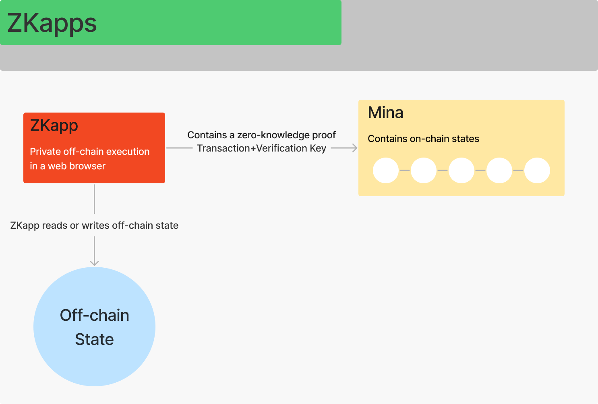

# ZKapps

## ZKapps as a market implementation of ZK-proof mechanism.

Today all cryptocurrency services function exclusively on-chain. The division of functions between **data storage**, **block production** and **ZK-proof** makes Mina a succinct and lightweight blockchain. Mina team decided to expand the function of ZK-proof performed by **ZK-snarks**, or **snark workers**, outside and provide it to the market by introducing **ZKapps**. Simply put, a ZKapp connects to the source website and produces proof of data on that website. The proof reveals only the fact, not the data itself. The zkApp shares the proof with the Mina network and then sends the verified proof to the counterparty via an encrypted transaction (see **Figure 1**). In fact, Zkapps are implementation of smart contracts in the Mina blockchain, an extension of the ZK-proof mechanism (see **Appendix 1**).

### Glossary Reference 1


**Smart contract** - computer algorithm designed to generate, manage and provide information about the ownership of something, used in decentralized autonomous organizations, banking and insurance sectors, securities markets, etc.

**Snark proof (ZK-proof)** - a cryptographic proof that allows one party to prove it possesses certain information without revealing that information.

**Snark (snark work)** - a cryptographic proof that allows one party to prove it possesses certain information without revealing that information.

**Snarker (snark worker)** - a network node that provides ZK-proof (snark-work).

**ZKapp** - a web application that is based on smart contracts and provides ZK-proof for the market.

For more information see [Mina Glossary](mina-glossary.md).


### **Figure 1. ZKapps**

ZKapps are web applications like **Daemons**, written in **TypeScript** using the Mina zkApp **CLI** that allow to use ZK-snarks to validate the input data in various applications. ZKapps are used off-chain, and they allow to sell ZK-proof services to external users anywhere where some data needs approval without disclosure of details.

### Glossary Reference 2


**Daemon** - the process in the Mina Protocol operating in the background waiting for a specific event or condition in order to be activated allowing a local client or wallet to talk to the Mina network.

**TypeScript** - the function which executes a smart contract’s custom logic. For this, it requires input from the users. It runs in a user’s web browser.

**CLI** - a text-based user interface that connects a user to a computer program or operating system. Through the CLI, users interact with a system or application by typing in the text (commands).

See [Mina glossary](mina-glossary.md).


Appendix 1 - Smart Contracts

A **smart contract** is a computer program or a transaction protocol which is intended to automatically execute, control or document legally relevant events and actions according to the terms of a contract or an agreement. The objectives of smart contracts are the reduction of the need for trusted intermediates, arbitrations and enforcement costs, fraud losses, as well as the reduction of malicious and accidental exceptions. The phrase and concept of smart contracts was developed by Szabo with the goal of bringing what he calls the "highly evolved" practices of contract law and practice to the design of electronic commerce protocols between strangers on the Internet.

The first attempts to implement the idea of smart contracts date back to “bit gold“, but the rise of blockchain technology empowered the use of smart contracts on a wider scale. Broadly, the Bitcoin protocol is seen as a weak version of the smart contract concept. Since Bitcoin, various cryptocurrencies have supported scripting languages which allow for more advanced smart contracts between untrusted parties.

However, it was not until Etherium brought this concept to common use. Smart contracts are the fundamental building blocks of Ethereum smart contract is a program that runs on the Ethereum blockchain. It's a collection of code (functions) and data ( state) that resides at a specific address on the Ethereum blockchain.

Smart contracts are a type of Etherium account. This means they have a balance and they can send transactions over the network. However, they're not controlled by a user, instead, they are deployed to the network and run as programmed. User accounts can then interact with a smart contract by submitting transactions that execute a function defined on the smart contract. Smart contracts can define rules, like a regular contract, and automatically enforce them via code. Smart contracts cannot be deleted by default, and interactions with them are irreversible.

In Mina smart contracts are brought to life by the use of ZKapps - an extension of the ZK-proof mechanism for external users. ZKapps use the smart contract logic to execute data validation for various applications, where it’s required to validate data without revealing them.

A ZKapp consists of a **smart contract** and a user interface. Because ZKapps are based on ZK-snarks, a ZKapp developer uses a **circuit** - which is the method from which a **prover function** and a corresponding **verifier function** are derived during the build process. To do this **private inputs** and **public inputs** are needed.

### Glossary Reference 3


**Circuit** - the method from which a prover function and a corresponding verifier function are derived during the build process in ZKapps.

**Private input** - the data that is entered in a ZKapp for ZK-proof. It’s not needed for the verifier function.

**Prover function** - the function which executes a smart contract’s custom logic. For this, it requires input from the users. It runs in a user’s web browser.

**Public input** - the data that is entered in a ZKapp for ZK-proof and is needed for the verifier function.

**Verifier function** - the function that validates whether a zero-knowledge proof successfully passes all the constraints defined in the prover function.

See [Mina glossary](mina-glossary.md).


A ZKapp runs simultaneously on-chain, or within Mina, and off-chain, in an external system. Within the Mina network, Mina acts as the verifier and runs the verifier function. A ZKapp performs data verification via a smart contract. Literally, a ZKapp **deploys** a smart contract on Mina. To do this, the developer uses Mina zkApp CLI. The deployment process sends a transaction containing the **verification key** to an **address** on the Mina blockchain. When a Mina address contains a verification key, it acts as a **ZKapp account**. Whereas a regular Mina account can receive any transactions, a ZKapp account can only successfully receive transactions containing proof that satisfies the verifier function. Any transactions that do not pass the verifier function will be rejected by the Mina network (see **Figure 2**).

### Glossary Reference 4


**Address** - the function which executes a smart contract’s custom logic. For this, it requires input from the users. It runs in a user’s web browser.

**Verification key** - The public address of a private key that serves as an identity of the subject of an account.

See [Mina glossary](mina-glossary.md).


### **Figure 2. ZKapps as smart contracts**

When a smart contract is executed and a ZK-proof is done, the new state has to be stored. Two different types of state exist on Mina: an **on-chain state** and an **off-chain state**. If the new state is stored on-chain, it can be used as a snark for block production. Each ZKapp account provides 8 fields of 32 bytes each of arbitrary storage. If a state requires more memory, an off-chain option then is in place. For larger data, it’s possible to store the root of a Merkle tree (or similar data structure) within the ZKapp’s on-chain storage that references additional off-chain state stored elsewhere, in any external data storage, e.g. IPFS. When a ZKapp runs in a user’s web browser, it may insert a state to an external storage.

When a ZKapp runs in a user’s web browser, it may insert a state to an external storage. When a transaction is sent to the Mina network, if it accepts this ZKapp transaction, i.e. if the proof and the state are valid, then the transaction would update the root of the Merkle tree that is stored on-chain.

### Glossary Reference 5


**Merkle tree** - A data structure in which every node is labeled with the cryptographic hash of a data block, and every node that is not a leaf (called a branch, inner node, or inode) is labeled with the cryptographic hash of the labels of its child nodes.

**On-chain state** - describes a state that lives on the Mina blockchain and is stored within a ZK-app account.

**Off-chain state** - describes a state stored anywhere else.

See [Mina glossary](mina-glossary.md).


## ZK-proof-based smart contracts and their properties. 

ZK-proof-based smart contracts, aka ZKapps, have the following properties:

1. **ZKapps preserve users’ privacy.** They use cryptographic algorithms to prove that something is true without unveiling the context or any other extra information around this fact. This literally means that zkApps end users interact using proofs of their personal data without having to share the data itself. For instance, zkApps can connect to a credit score provider to prove that your credit score is above a certain threshold.
2. **ZKapps can execute unlimited off-chain computations at a flat fee.** Other blockchains normally use a variable gas fee-based model which is dependent on the network supply and demand at any given moment. ZKapps, on the contrary, can perform complex computations off-chain while charging only a flat fee to send the zero knowledge proof to the chain for verification of this computation work.
3. **ZKapps can connect Web2 to Web3.** Currently, other blockchains cannot seamlessly bring information on the Internet on-chain, which is a limitation to the utility of blockchain applications. zkApps, however, can privately communicate with any website, proving facts about APIs and webpages on the Internet, and access verified real world data that’s going to be used on-chain. This is possible due to **zkOracles**, which uses HTTPS to connect real world data to a blockchain in a trustless manner.
4. **ZKapps can be accessed from other chains and devices.** Due to Mina’s succinct design, Mina’s zero-knowledge proof programmability can be reached from other chains and ultimately even end user devices via a special blockchain bridge.
5. **ZKapps are written in Typescript.** ZkApps are programmed using **SnarkyJS**, which is a Typescript-based library. This greatly expands the pool of developers who can easily get started building zkApps.

### Glossary Reference 6


**zkOracle** - a Polkadot-based privacy-preserving oracle network, aiming to expand the application areas of Web3 applications in real business environments. It is used for ZKapps in Mina.

**SnarkyJS** - describes a state that lives on the Mina blockchain and is stored within a ZK-app account.

For more information see [Mina Glossary](mina-glossary.md).


## ZKapp use cases. 

Essentially, there are 3 main directions where ZKapps can be useful:

1. Ensuring user data will remain private while moving from online to on-chain.
2. Permissionless verifiable web Oracles to allow the transition of decentralized information.
3. Providing access to any website or service privately without handing over personal data.

There is a number of real-life use cases where ZKapps may be applied, where it’s required to verify data without disclosing them (see **Figure 3**). Those include, but are not limited to the following:

1. Verifying credit histories for banks and non-bank financial organizations.
2. Providing medical history.
3. Checking debit-credit and payment history for plastic cards.
4. Secure log-in.
5. Identity verification systems.
6. Insurance.
7. Auctions.
8. Contracting.
9. Managing NFTs.
10. Communication with public agencies and organizations to prove personal identity or other important personal data.
11. Neural network identification.
12. Games and quizzes.
13. Exchange.
14. Web wallets.
15. Booking services.
16. Voting.
17. Brokerage.
18. Accounting.
19. Testing and examinations.
20. Notary services.

### Figure 3. ZKapps Use Cases

