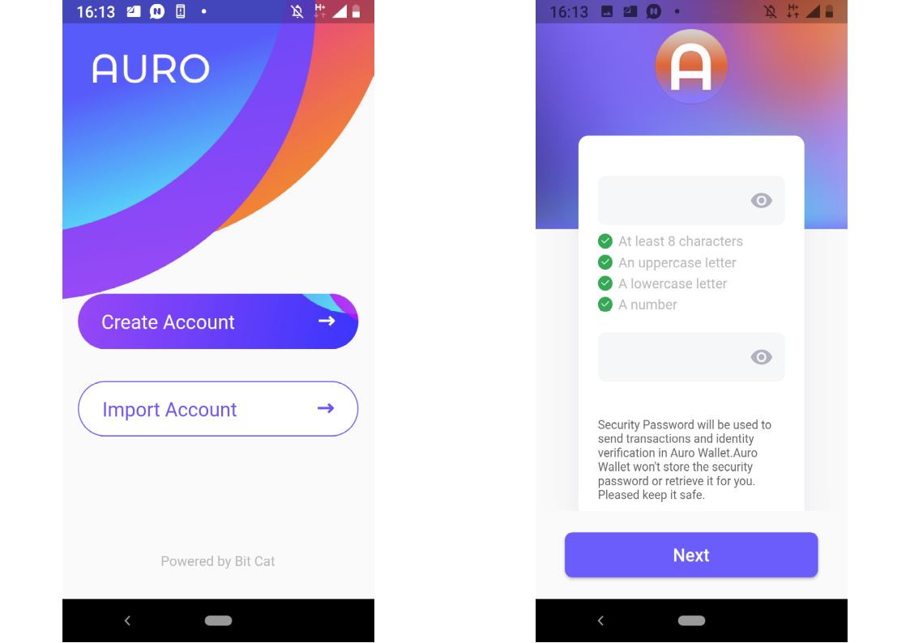
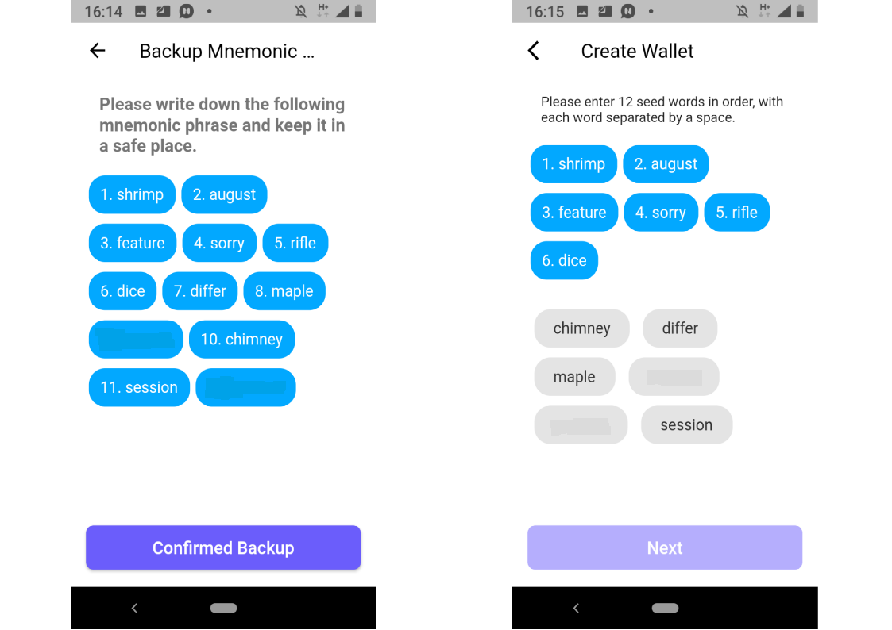
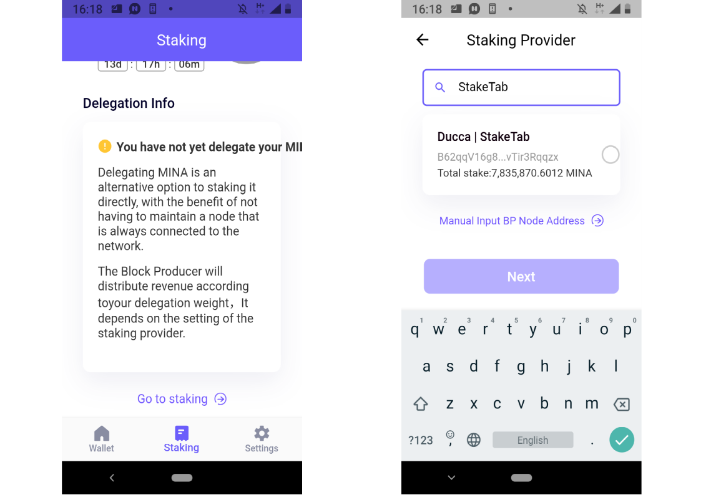
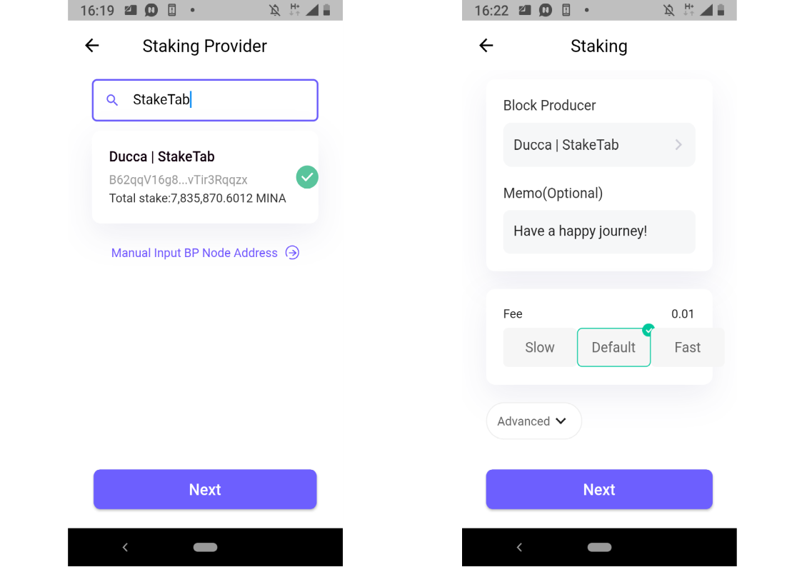

# How to stake Mina from Auro browser and mobile wallet using Ledger

1\. Go to [aurowallet.com](http://aurowallet.com/).

2\. Click on “Chrome” or “Firefox” buttons. Alternatively, click on "Download apk", launch _.apk_ on your smartphone, install and open it. One more option is to install the wallet from [Google Play.](https://play.google.com/store/apps/details?id=com.aurowallet.www.aurowallet%5D) If you install the Auro wallet on your smartphone or android emulator, you don't need the steps 3-4. All the steps below are similar for both Browser and Android versions of the wallet.

3\. Click on "Add to Chrome" or "Add to Firefox" button.

4\. Auro wallet icon will appear at the top right corner pane of a browser. Click on it.

5\. Click on "Create account". If you already have one, you can restore it with your mnemonic phrase clicking on "Restore account" (in the Restore case you don't need the 6-12 steps).

6\. Agree with the Terms of Use to create account and use the wallet.

7\. Create the password.

8\. Copy your mnemonic phrase. For example, you can write it on a piece of paper, make a screenshot or copy into a _.txt_ file. Please make sure it is stored in a safe place and no one will be able to access. Anyone can use this private key to access your wallet. Two copies of the phrase are usually recommended. Click on "Confirm backup".

9\. Enter the phrase, following the order of the words. Click on "Next", then click on "Start".

10\. Click on the violet box button at the top right corner of the wallet.

11\. Click on the "Ledger" at the bottom right corner.

12\. Connect your Ledger to the computer if it is disconnected, then open Mina app on the Ledger and select "Open application" option.

13\. Click on "Import" button in your Auro wallet.

14\. "Get Address" window will appear on your Ledger screen. Select "Generate" option.

15\. Ledger account address will appear in your Auro wallet. Select "Approve" option on your Ledger screen.

16\. Click on "Staking" button at the bottom center. Then click on "Go to staking".

17\. Enter your Mina staking provider's name or address into the search field. For example, if you want to delegate Mina funds to [StakeTab](https://staketab.com/) provider, enter "StakeTab" or `B62qqV16g8s744GHM6Dph1uhW4fggYwyvtDnVSoRUyYqNvTir3Rqqzx` into the field.

18\. Click on the staking provider name, then click on "Next". Enter a transaction memo (some your comment on transaction that will be saved in the blockchain, optional step) select a transaction fee amount and click "Next".

19\. Check transaction details. If you need to fix something, click on the `x` button at the top right corner and correct the data you entered in the previous steps. If no corrections needed, enjoy "Confirm" button.

20\. Sign transaction on your Ledger screen by selecting "Approve" option.

21\. When the transaction is confirmed in the Mina blockchain, your tokens are delegated to the Mina validator.

To check a balance of your Mina account, transaction history, validators data, blocks mining data, time locks stats, rewards stats and calculation, and various charts introducing a comprehensive picture of Mina blockchain, enjoy [Mina block explorer](https://mina.staketab.com/) from Staketab.
