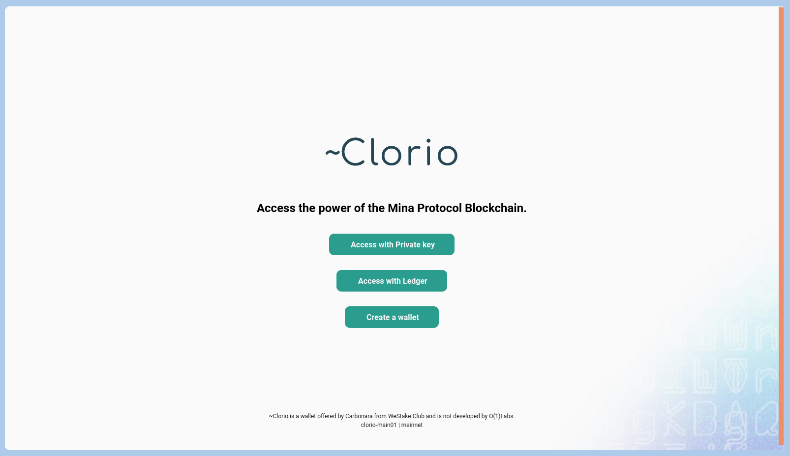
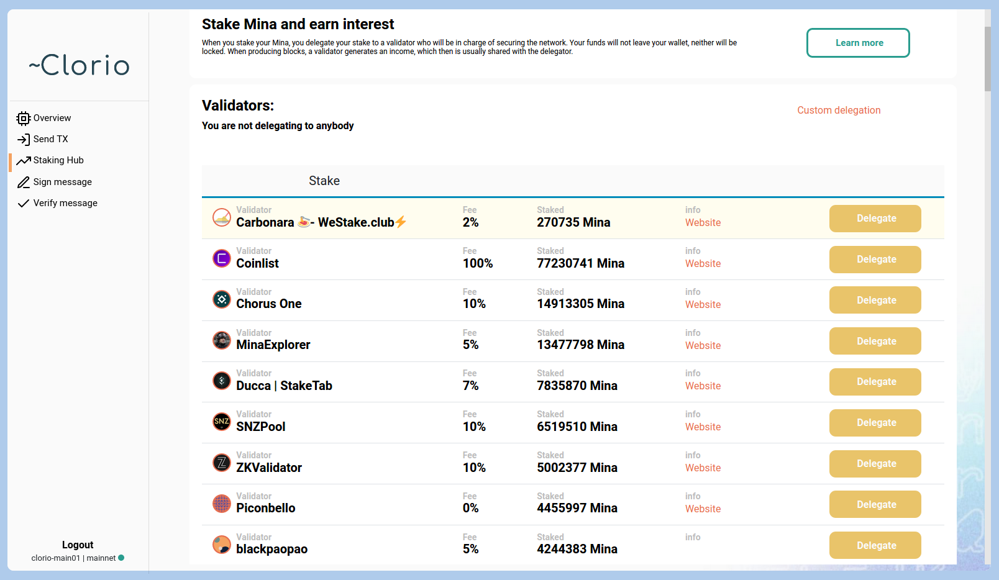
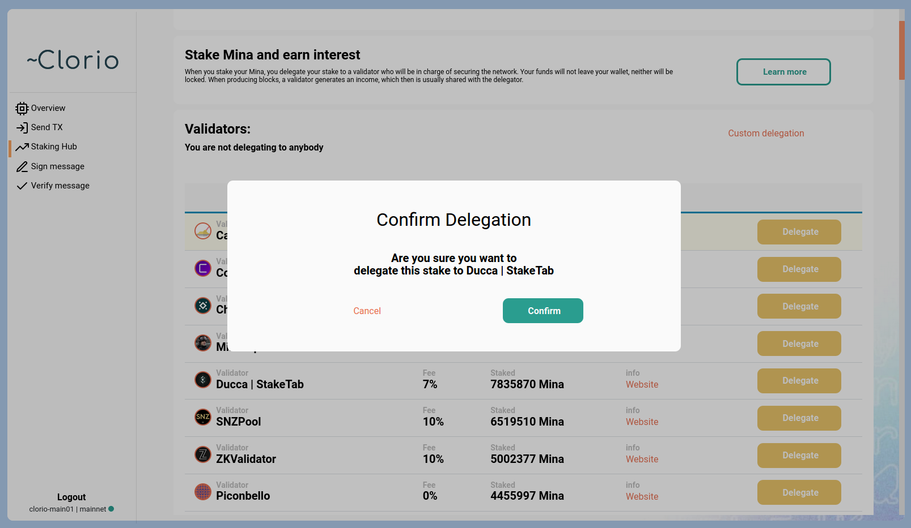
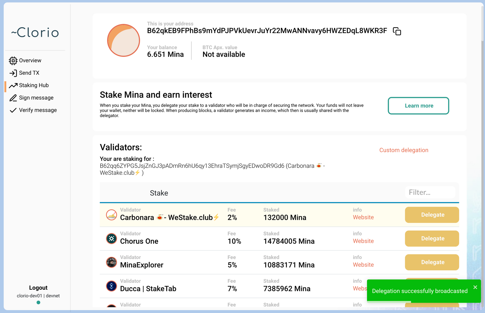

# How to stake Mina from Clorio browser and desktop wallet using Ledger

1\. Go to [clor.io](https://clor.io) if you want to use desktop app version of the wallet or go to [mainnet.clor.io](https://mainnet.clor.io) if you prefer browser version. Clorio wallet does not require installation in the browser as an addon, you just open it in the browser tab. If you choose the browser version, you dont need the 2-5 steps.

2\. Click on "Download" button.

3\. On the GitHub page opened, scroll down to the "Assets" section.

4\. Choose a Clorio wallet version for your OS (_.AppImage_ is for Linux, _.dmg_ is for macOS, _.zip_ is for Windows; if you want to build the wallet yourself, use the Source code archives in the bottom of the section of the GitHub page). How to download and launch Clorio wallet for Windows, Mac OSX and Linux, see [here](https://docs.clor.io/desktop-application/download-clorio-wallet-for-windows-mac-osx-and-linux)[.](https://docs.clor.io/desktop-application/download-clorio-wallet-for-windows-mac-osx-and-linux])

5\. Launch Clorio.

6\. Agree with the Terms of Use to create account and use the wallet.

7\. Click on "Access with Ledger" button.

8\. Connect your Ledger to the computer if it is disconnected, then open Mina app on the Ledger and select "Open application" option.

9\. Check "Ledger connected" checkmark anp click "Continue". If you have several Ledger accounts and want to use a custom one, click on "Click here to select a custom account" and enter a number of the account needed, then click on "Continue".

10\. "Get Address" window will appear on your Ledger screen. Select "Generate" option.

11\. Ledger account address will appear in your Clorio wallet. Select "Generate" option on your Ledger screen.

12\. Click on "Access wallet" in your Clorio wallet.

13\. Click on "Staking Hub" at the left pane. The "Staking Hub" section contains a list of available Mina staking providers.

14\. Choose a staking provider and click on "Delegate" button. If you would like to stake Mina with us, you are welcome to choose [Ducca | StakeTab](http://staketab.com) provider.

15\. Click on "Confirm" in the Confirm delegation window.

16\. Enter a fee in the "Insert a Fee" window. You can enter it manually or select between "Average" and "Fast" options.

17\. Enter your private key to confirm the delegation.

18\. Sign transaction on your Ledger screen by selecting "Approve" option.

19\. If your delegation was successful, you will see a "Delegation successfully broadcasted" notification in the bottom left corner of the Clorio wallet.

To check a balance of your Mina account, transaction history, validators data, blocks mining data, time locks stats, rewards stats and calculation, and various charts introducing a comprehensive picture of Mina blockchain, enjoy [Mina block explorer](https://mina.staketab.com) from Staketab.
