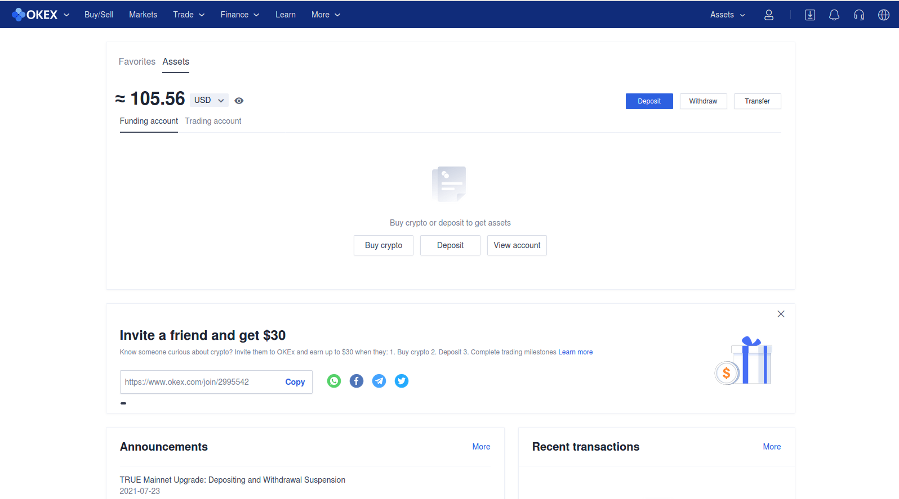

# How to stake Mina using own Mina node

## How to install Linux? <a id="How-to-install-Linux?"></a>

To stake Mina from your command line without any intermediary entity, we recommend to install Ubuntu as one of the most user-friendly Linux distributions. You can find guides how to install Ubuntu here:

* [How to install Ubuntu?](https://ubuntu.com/tutorials/install-ubuntu-desktop#1-overview)
* [How to install Ubuntu alongside Windows?](https://www.tecmint.com/install-ubuntu-alongside-with-windows-dual-boot/)
* [How to install Ubuntu on virtual machine?](https://www.lifewire.com/install-ubuntu-linux-windows-10-steps-2202108)

If you prefer some another Linux distribution to use for Mina staking, the steps below are similar.

## How to stake Mina? <a id="How-to-stake-Mina?"></a>

### Launch terminal <a id="Launch-terminal"></a>

Click _Ctrl+Alt+T._

Linux terminal is opened. You can find a short guide of terminal commands for beginners [here](https://ubuntu.com/tutorials/command-line-for-beginners#3-opening-a-terminal%5D.).

### Create private key <a id="Create-private-key"></a>

At first, enter the following commands to install necessary packages:

```text
echo "deb [trusted=yes] http://packages.o1test.net release main" | sudo tee /etc/apt/sources.list.d/mina.list
sudo apt-get update
sudo apt-get install -y curl unzip mina-mainnet=1.1.5-a42bdee
```

Then install the key generator with the command:

```text
sudo apt-get install mina-generate-keypair=0.2.12-718eba4
```

### Generate the key:

When creating keys, you will be asked to create a password.

#### Option 1 with a package:

```text
mina-generate-keypair -privkey-path ~/keys/my-wallet
```

#### Option 2 using docker:

```text
sudo docker run  --interactive --tty --rm --volume $(pwd)/keys:/keys minaprotocol/generate-keypair:0.2.12-718eba4 -privkey-path /keys/my-wallet
```

### Set necessary permissions:

```text
chmod 700 $HOME/keys
chmod 600 $HOME/keys/my-wallet
```

### Check private key <a id="Check-private-key"></a>

When checking the key, you will be asked to enter the password from it.

#### Option 1 with a package:

```text
mina-validate-keypair -privkey-path ~/keys/my-wallet
```

#### Option 2 using docker:

```text
sudo docker run --interactive --tty --rm --entrypoint=mina-validate-keypair --volume $(pwd)/keys:/keys minaprotocol/generate-keypair:0.2.12-718eba4 -privkey-path /keys/my-wallet
```

In both cases, if everything is ok with your keys, you will receive a message:

```text
Verified a transaction using specified keypair
```

It means your keys have been verified.

Now let's write your public key to the server in the `.bashrc` file so that we don't export them again next time.

```text
echo 'export KEYPATH=$HOME/keys/my-wallet' >> $HOME/.bashrc
echo 'export MINA_PUBLIC_KEY=$(cat $HOME/keys/my-wallet.pub)' >> $HOME/.bashrc
source ~/.bashrc
```

## Launch a node with Docker

### Install Docker

Install and activate Docker:

```text
sudo apt install docker.io curl -y \
&& sudo systemctl start docker \
&& sudo systemctl enable docker
```

### Firewall configuration


If your VPS server has a built-in Firewall, then you should open ports 8302 and 8303 there.

If not, then follow the commands below:


Open ports 8302 and 8303:

```text
sudo iptables -A INPUT -p tcp --dport 8302:8303 -j ACCEPT
```

### Run a node

Variables description:  
  
`--name mina` - you can use any name for the container, or leave it as it is;  
`-block-producer-password "YOUR PASS"` - instead `YOUR PASS` enter the password for your key.  
`$KEYPATH` - path to the file with the private key `my-wallet`. 

Optional:  
`--coinbase-receiver B62qp...` - flag to redirect block reward to another address.

```text
sudo docker run --name mina -d \
--restart always \
-p 8302:8302 \
-p 127.0.0.1:3085:3085 \
-v $(pwd)/keys:$HOME/keys:ro \
-v $(pwd)/.mina-config:$HOME/.mina-config \
--env CODA_PRIVKEY_PASS='YOUR_PASS' \
minaprotocol/mina-daemon-baked:1.1.5-a42bdee daemon \
-block-producer-key $KEYPATH \
--peer-list-url https://storage.googleapis.com/mina-seed-lists/mainnet_seeds.txt \
--insecure-rest-server \
--open-limited-graphql-port \
--limited-graphql-port 3095 \
--file-log-level Debug \
-log-level Info
```

### Viewing logs with docker

View running containers:

```text
sudo docker ps -a
```

Node container logs:

```text
sudo docker logs --follow mina -f --tail 1000
```

Node status:

```text
sudo docker exec -it mina mina client status
```

Wait for the node to synchronize. The _Sync status:_ field should say _Synced_ \(see the screenshot below\). If the status says _Catched_, then you need to wait a little longer. After this you can start importing your keys.



## Launch a node with Service

### Firewall configuration

Open ports 22, 8302 and 8303 and activate the Firewall:

```text
sudo ufw allow 22 \
&& sudo ufw allow 8302 \
&& sudo ufw allow 8303 \
&& sudo ufw enable
```

We check the status of open ports with the command:

```text
sudo ufw status
```


If you do not have UFW installed on your server, install it using the command `sudo apt install ufw`


### Node configuring

Downloading package `Mina`:

```text
echo "deb [trusted=yes] http://packages.o1test.net release main" | sudo tee /etc/apt/sources.list.d/mina.list
sudo apt-get update
sudo apt-get install -y curl unzip mina-mainnet=1.1.5-a42bdee
```

Download the file with peers:

```text
curl https://storage.googleapis.com/mina-seed-lists/mainnet_seeds.txt > ~/peers.txt
```

Setting up the `mina-env` file:

```text
nano .mina-env
```

We copy and paste the variables into the file after entering your password from the key instead of `YOUR PASS FOR KEYS`:

```text
CODA_PRIVKEY_PASS="YOUR PASS FOR KEYS"
EXTRA_FLAGS=" -file-log-level Debug"
```

Save ans exit: CTRL+S and CTRL+X

### Start the service

```text
systemctl --user daemon-reload
systemctl --user start mina
systemctl --user enable mina
sudo loginctl enable-linger
```

Viewing logs:

```text
journalctl --user-unit mina -n 1000 -f
```

## Importing keys

We import an account with a key with the following command:

With Service:

```text
mina accounts import -privkey-path $HOME/keys/my-wallet
```

With Docker:

```text
sudo docker exec -it mina mina accounts import -privkey-path $HOME/keys/my-wallet
```

The list of your accounts can be viewed with the command below:

```text
mina accounts list
```

## Unlock the account

First, let's export the Public Key:

```text
export MINA_PUBLIC_KEY=$(cat $HOME/keys/my-wallet.pub)
```

Let's unlock the account so that you can move tokens:

With Service:

```text
mina accounts unlock -public-key $MINA_PUBLIC_KEY
```

With Docker:

```text
sudo docker exec -it mina mina accounts unlock -public-key $MINA_PUBLIC_KEY
```

In the password input field, write your password from the key and press ENTER.

## Stake tokens

Use the following command template:

```text
mina client delegate-stake \
-sender "PASTE YOUR MINA WALLET ADDRESS HERE" \
-receiver "PASTE VALIDATOR'S ADDRESS HERE" \
-fee "PASTE FEE HERE"
```

Example of the command above:

With Service:

```text
mina client delegate-stake \
-sender B62qnJHBeVJqWamtDhWDPwrX7Y5jiXKcMKTuvug9LQ8ictwNTWN7YvJ \
-receiver B62qqV16g8s744GHM6Dph1uhW4fggYwyvtDnVSoRUyYqNvTir3Rqqzx \
-fee 0.03
```

With Docker:

```text
sudo docker exec -it mina mina client delegate-stake \
-sender B62qnJHBeVJqWamtDhWDPwrX7Y5jiXKcMKTuvug9LQ8ictwNTWN7YvJ \
-receiver B62qqV16g8s744GHM6Dph1uhW4fggYwyvtDnVSoRUyYqNvTir3Rqqzx \
-fee 0.03
```

Specify the following Mina fee amount depending on transaction speed you want:

* Moderate speed is 0.01
* Fast speed is 0.05
* Very fast speed is 0.1

Tokens are on the journey to stake and will be used by the staking provider soon. Just wait for your Mina rewards from now. Don't be scared that your tokens are still visible on your balance. Physically Mina tokens are not moved to the staking provider from your wallet.

The whole balance of your address will be delegated into stake to a Mina validator.

The command above sends your Mina funds to [StakeTab](https://staketab.com/) staking provider. If you want to stake Mina with another provider, you can select one on the [Mina block explorer](https://mina.staketab.com/).

After delegation, you can stop your node running. There is no need for that after successful delegation.

## Resources <a id="Resources"></a>

There are much more options to stake Mina from your own node. For example, you can use Docker, set up TMUX and Snark stopper or update your node. For details, please see the [How to stake Mina using own delegating node detailed guide](https://icohigh.gitbook.io/mina-node-testnet/english/generating-and-verifying-keys).

