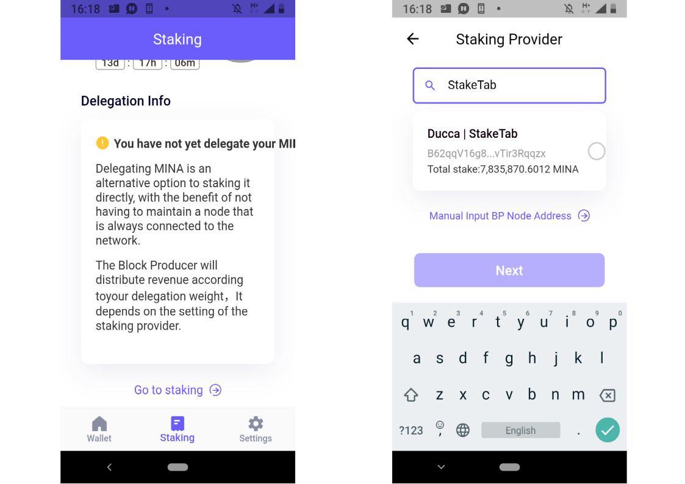

# How to stake Mina using Auro browser and mobile wallet

1. Go to [aurowallet.com](http://aurowallet.com/).
2. Click on “Chrome” or “Firefox” buttons. Alternatively, click on "Download apk", launch _.apk_ on your smartphone, install and open it. One more option is to install the wallet from [Google Play](https://play.google.com/store/apps/details?id=com.aurowallet.www.aurowallet%5D)[.](https://play.google.com/store/apps/details?id=com.aurowallet.www.aurowallet%5D.) If you install the wallet on your smartphone or android emulator, you don't need the steps 3-4. All the steps below are similar for both Browser and Android versions of the wallet.
3. Click on "Add to Chrome" or "Add to Firefox" button.
4. Auro wallet icon will appear at the top right corner pane of a browser. Click on it.
5. Click on "Create account". If you already have one, you can restore it with your mnemonic phrase clicking on "Restore account" \(in the Restore case you don't need the 6-12 steps\).
6. Agree with the Terms of Use to create account and use the Auro wallet.
7. Create the password.


8. Copy your mnemonic phrase. For example, you can write it on a piece of paper, make a screenshot or copy into a _.txt_ file. Please make sure it is stored in a safe place and no one will be able to access. Anyone can use this private key to access your wallet. Two copies of the phrase are usually recommended. Click on "Confirm backup".

9. Enter the phrase, following the order of the words. Click on "Next", then click on "Start".


10. To stake Mina using Auro wallet, you need to deposit Mina funds to your address in the wallet. Click on "Receive" button to get the address \(if you already have Mina funds in your Auro wallet, you don't need the 11-12 steps\).

11. Click on "Copy Address" button \(or use a QR-code\).


12. Send Mina funds to the Mina address copied. If there is the first transaction into your Auro wallet, 1 Mina will be charged from the input amount \("address activation" fee\).

13. Click on "Staking" button at the bottom center. Then click on "Go to staking".


14. Enter your Mina staking provider's name or address into the search field. For example, if you want to delegate Mina funds to [StakeTab](https://staketab.com/) provider, enter "StakeTab" or the following validator's address:

```text
B62qqV16g8s744GHM6Dph1uhW4fggYwyvtDnVSoRUyYqNvTir3Rqqzx
```



15. Click on the Mina staking provider name, then click on "Next". Enter a transaction memo \(some your comment on transaction that will be saved in the blockchain, optional step\) select a transaction fee amount and click "Next".


16. Check transaction details. If you need to fix something, click on the x button at the top right corner and correct the data you entered in the previous steps. If no corrections needed, enjoy "Confirm" button.

17. When the transaction is confirmed in the Mina blockchain, your tokens are delegated to the staking provider.

