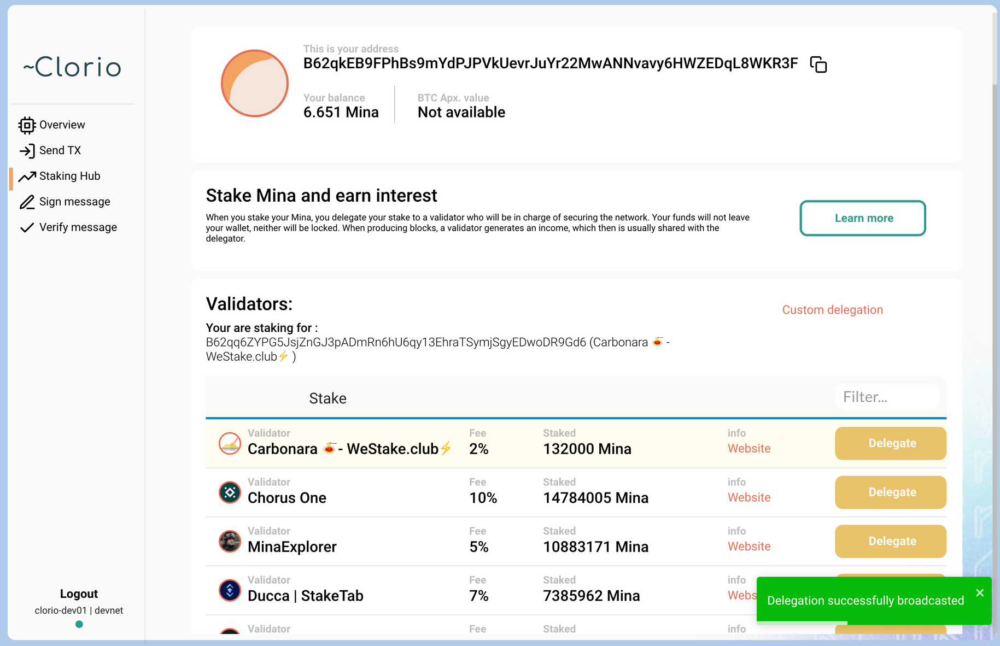

# How to stake Mina using Clorio browser and desktop wallet

1. Go to [clor.io](https://clor.io/) if you want to use desktop app version of the wallet or go to [mainnet.clor.io](https://mainnet.clor.io/) if you prefer browser version. Clorio wallet does not require installation in the browser as an addon, you just open it in the browser tab. If you choose the browser version, you dont need the 2-5 steps.
2. Click on "Download" button.
3. On the GitHub page opened, scroll down to the "Assets" section.
4. Choose a Clorio version for your OS \(_.AppImage_ is for Linux, _.dmg_ is for macOS, _.zip_ is for Windows; if you want to build the wallet yourself, use the Source code archives in the bottom of the section\). How to download and launch Clorio wallet for Windows, Mac OSX and Linux, see [here](https://docs.clor.io/desktop-application/download-clorio-wallet-for-windows-mac-osx-and-linux)[.](https://docs.clor.io/desktop-application/download-clorio-wallet-for-windows-mac-osx-and-linux%5D.)
5. Launch Clorio.

6. Agree with the Terms of Use to create account and use the wallet.

7. Click on "Create a wallet". If you already have one, you can restore it with your private key clicking on "Access with Private key" \(in this case you don't need the 8-9 steps\). If you want to access the wallet with Ledger Nano S, click on "Access with Ledger". See [here](https://docs.minaprotocol.com/en/advanced/ledger-app-mina) how to install Mina App to Ledger Nano S. Ledger Nano X is not supported yet.

8. Copy your address and private key. For example, you can write the private key on a piece of paper, make a screenshot or copy into a _.txt_ file. Please make sure it is stored in a safe place and no one will be able to access it. Anyone can use this private key to access your wallet. Two copies of the private key are usually recommended. Click on "Continue".

9. Enter your private key into the "Verify your Private key" field and click on "Continue".

10. Send Mina funds to your Clorio address. You have copied it at the step \#8 or you can copy it any time at the top of your Clorio account \("This is your address" field. If there is the first transaction into your Clorio wallet, 1 Mina will be charged from the input amount \("address activation" fee\).

11. Click on "Staking Hub" at the left pane. The "Staking Hub" section contains a list of available Mina staking providers.

12. Choose a staking provider and click on "Delegate" button. If you would like to stake Mina with us, you are welcome to choose [Ducca \| StakeTab](http://staketab.com/) provider.

13. Click on "Confirm" in the Confirm delegation window.

14. Enter a fee in the "Insert a Fee" window. You can enter it manually or select between "Average" and "Fast" options.

15. Enter your private key to confirm the delegation.

16. If your delegation was successful, you will see a "Delegation successfully broadcasted" notification in the bottom left corner of the Clorio wallet.

