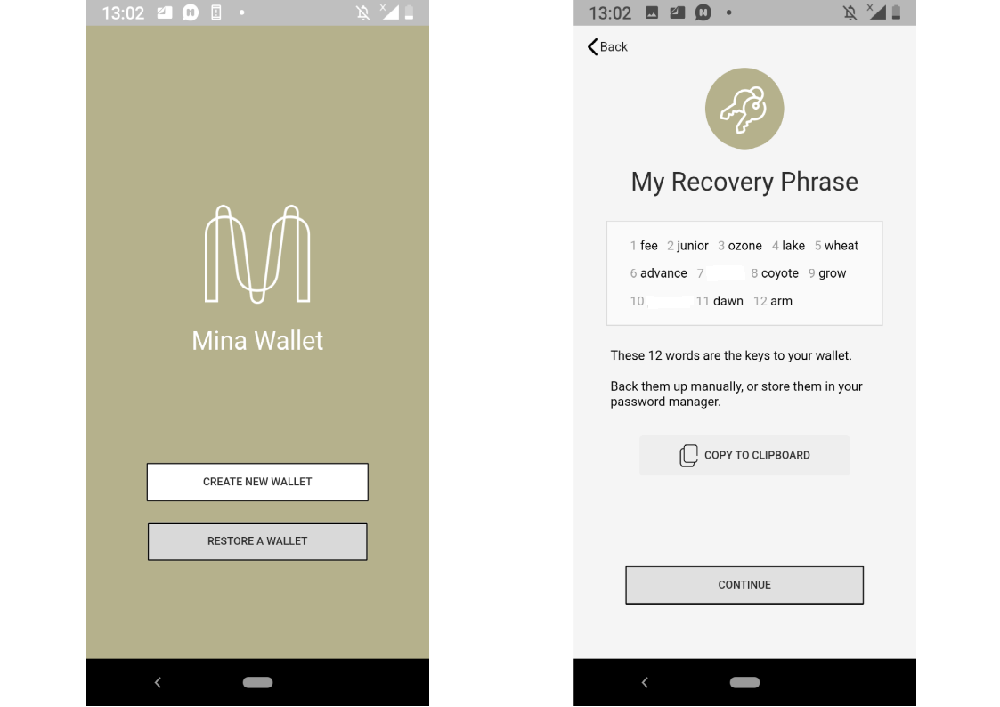
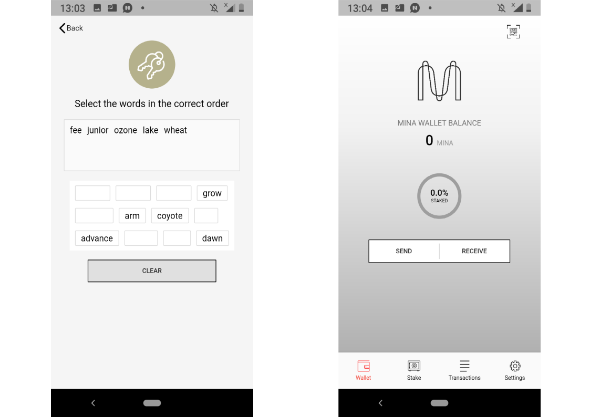
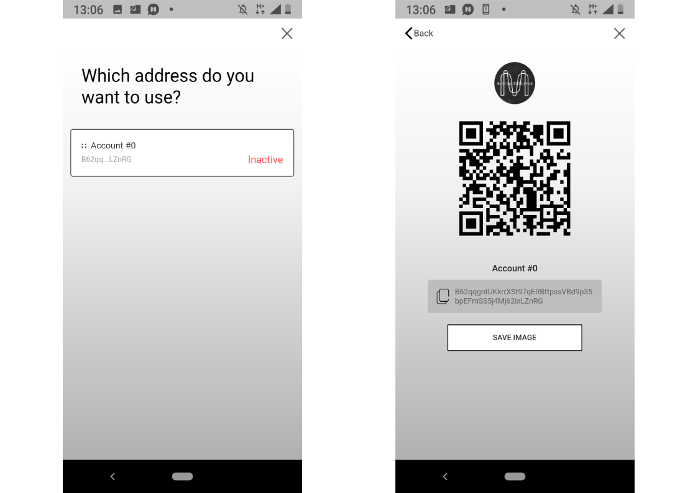
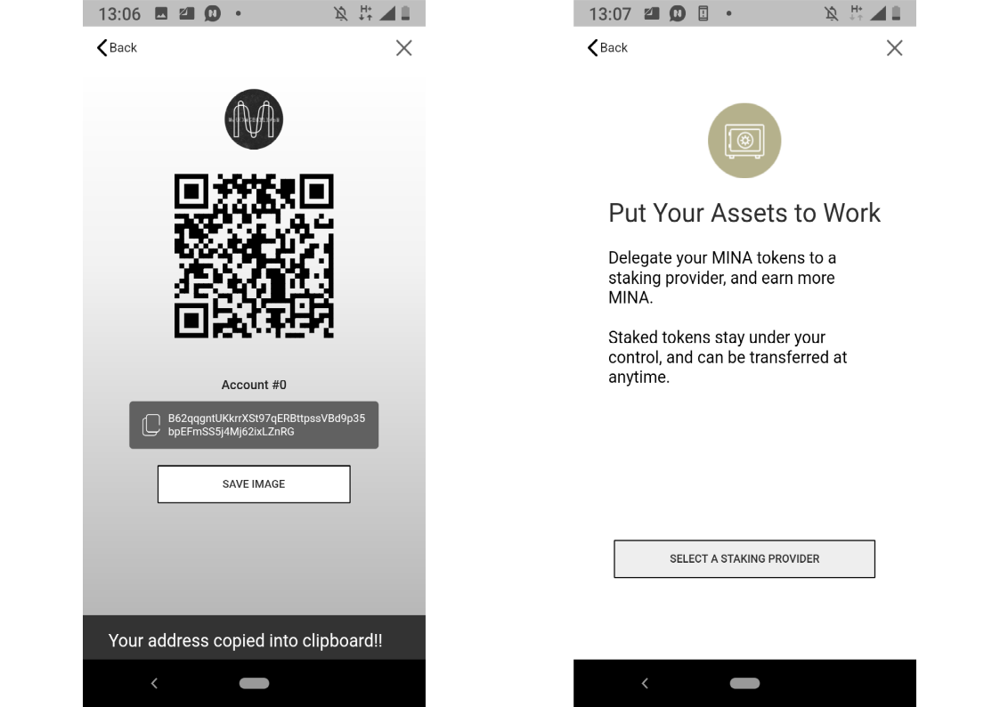
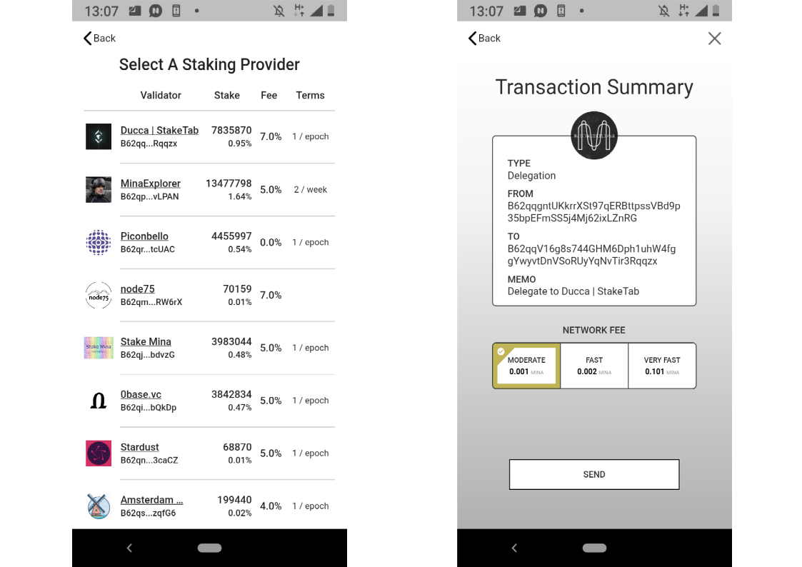
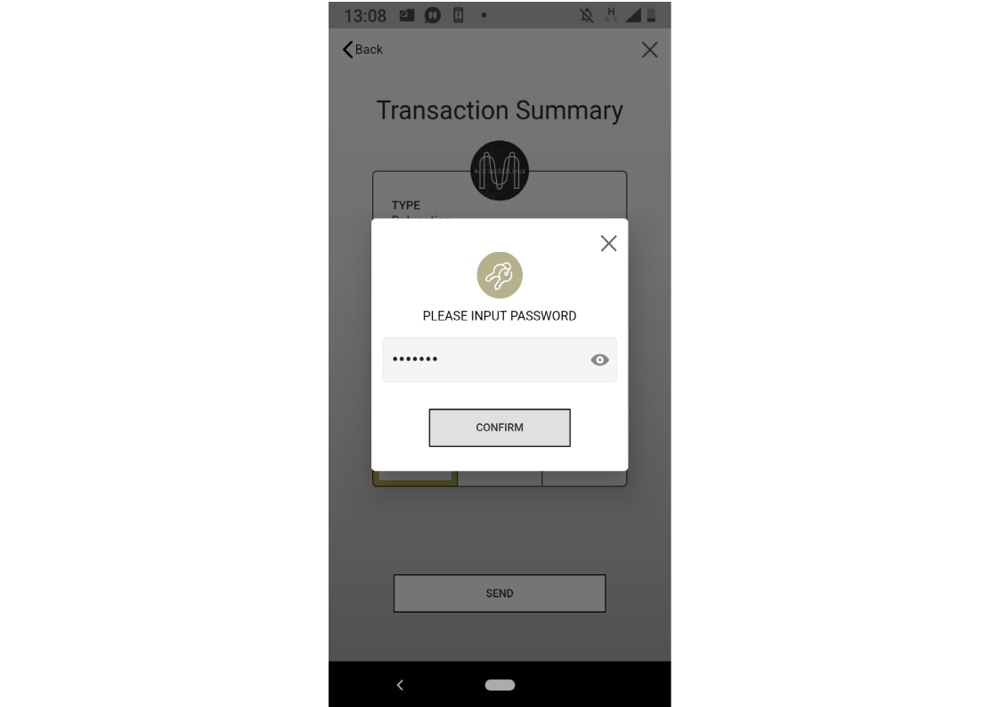

# How to stake Mina using Staking-Power mobile wallet

1. Go to [crackerli/coda-mobile-wallet](http://github.com/crackerli/coda-mobile-wallet) and follow guidelines in "How to build” section. Then you don't need the steps 2-3.
2. Click on "Google Play" or "App Store" Button. Alternatively, go to [apkcombo.com](http://apkcombo.com/) downloader and paste a link to Staking-Power app in Google Play into a field, then click on "Generate Download Link". Beware: APKcombo is a third-party downloader, use at own risk.
3. Install the wallet on your smartphone or android emulator on your PC. To install Staking-Power wallet on iOS, Chinese Mainland users should install TestFlight at first, then scan the QR-code from the "Install on iOS" section from the [page](https://github.com/crackerli/coda-mobile-wallet%5D) \(or find the code below\) and follow the guidelines.

4. Launch Staking-Power wallet and click on "Create new wallet". If you already have Staking-Power wallet, you can access it with your recovery phrase by clicking "Restore a wallet" \(then you don’t need the 5-7 steps\).

5. Check if nobody can peek your screen and click "I understand".

6. Copy your recovery phrase. For example, you can write it on a piece of paper, make a screenshot or copy into a _.txt_ file. Please make sure it is stored in a safe place and no one will be able to access it. Anyone can use this private key to access your wallet. Two copies of the phrase are usually recommended. Click on "Continue".

7. Select your recovery phrase words in the correct order. Press "Clear" if you made a mistake. If the order is correct, press "Continue".

8. Create a password, click on checkmark confirming you understand that if you lose the password, you will have no access to your Staking-Power wallet. In the case of losing the password you will have to reinstall Staking-Power wallet and recover it using your recovery phrase \(see the step 4\). Click on "Continue".

9. To stake Mina funds, you need to deposit it to your Staking-Power wallet. Click on "Receive", then click on address \(marked with "Inactive" caption in red\), then on "Copy" button to the left of the address.

10. Send Mina funds to the address copied. If there is the first transaction into your Staking-Power wallet, 1 Mina will be charged from the input amount \("address activation" fee\).

11. Get back to the main screen and select "Stake" option at the bottom.

12. Click on the address to which you have deposited Mina funds, then click on "Select a Staking Provider".

13. Click on a staking provider you would like to delegate your Mina funds. If you would like to stake Mina with us, you are welcome to choose [Ducca \| StakeTab](http://staketab.com/) provider.

14. Check transaction data. If it is correct, click on desired transaction fee, then click on "Send".

15. Enter your password, then click "Confirm".

16. See transaction details in the block explorer clicking on "View in block explorer" or close "Transaction Summary" window. When the transaction is confirmed in the blockchain, your tokens are delegated to the provider.

