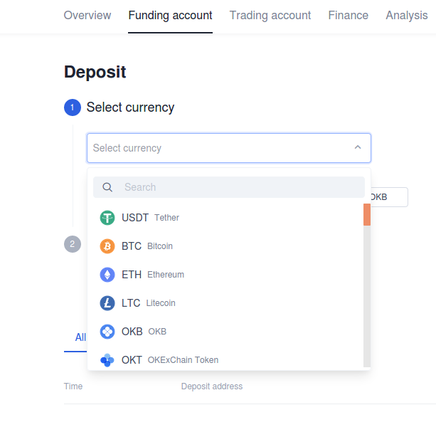
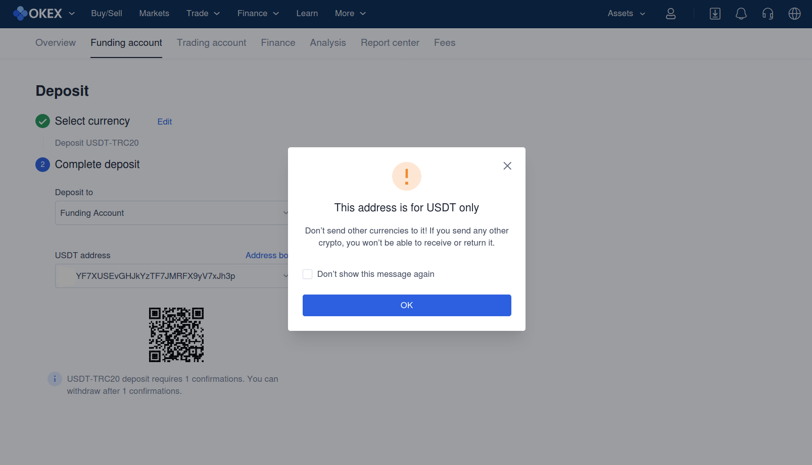
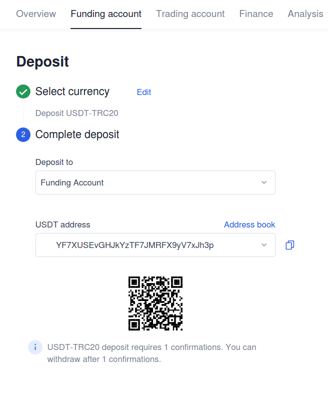
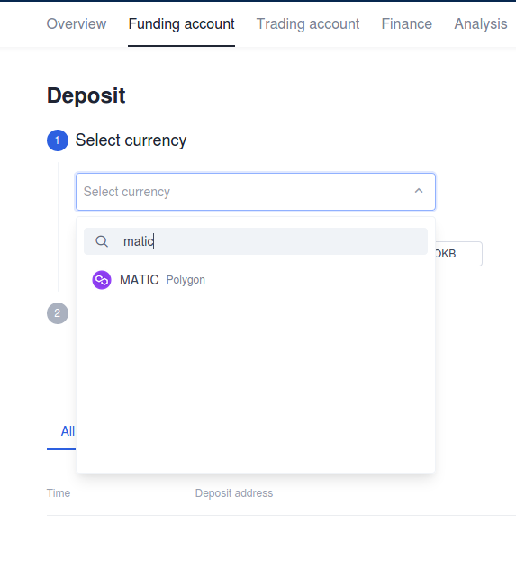

# How to buy ATOM on OKEx centralized exchange

1. Sign up to [OKEx website](https://www.okex.com/join/2995542).

2. Create an OKEx account. OKEx doesn't have mandatory KYC currently.

## How to deposit funds to OKEx

1. Click on "Assets" tab.

2. Click on "Deposit" blue button.

3. Click on "Select currency".

4. Select an asset you want to deposit by scrolling the list or typing into the field. ATOM is traded in a pair with the USDT stabelcoin \(its price equal to the US dollar\), so the fastest way to buy ATOM is to make a deposit in USDT. But if you have another asset, you can make a deposit with it. After deposit in this asset, just exchange it into USDT using the [OKEx](https://www.okex.com/join/2995542) terminal. 

So, there are two subguides below: how to buy ATOM with USDT and how to buy ATOM with another asset.

## How to buy ATOM with USDT

1. Select USDT as depositing asset and choose a network: Ethereum \(ERC-20\), TRON \(TRC-20\) or OKExChain. Make sure you choose the correct network of your stablecoin to deposit, otherwise the funds just won't come.

2. Confirm [OKEx](https://www.okex.com/join/2995542) warning.

3. Copy your USDT address and send your USDT funds to it.

4. When the USDT funds arrive, click on the three dots in the USDT section of your Funding account, select "Transfer" and move the funds into the Trading account to buy ATOM for USDT.

5. Go to the Trading account and check your USDT move. Click on "Trade" option, then select "Basic trading".

6. Terminal is opened. Click on the "BTC/USDT" option and enter "ATOM" into an asset search field.

7. In the ATOM/USDT window of the terminal, click on the "Market" option. This provides the option to buy ATOM quickly and at market price.

8. When Market section is opened, enter an amount of USDT for wich you want to buy ATOM.

9. Click "Buy" button. 

10. Confirm your order. Check filling of your order in the Order history section at the bottom of the terminal. 

## How to buy ATOM depositing another asset

To buy ATOM with another asset \(e. g. BTC, ETH, XRP, MATIC\), you need to deposit this asset first the same way you deposit USDT, then exchange the asset to the USDT and then exchange USDT for ATOM.

## How to withdraw ATOM from OKEx

1. Get back to your trading account and check the ATOM balance. To withdraw ATOM to the external wallet, click on the three dots in the "Action" column of your Trading account, select "Transfer" and move the ATOM funds into your Funding account. To withdraw ATOM to the external wallet you need to move it there. 

2. Enter the amount you want to transfer into the "Amount" field. Click on "Transfer all" if you want to withdraw all your ATOM from the exchange.

When transfer is successful, the balance of your Trading account will be reduced by the amount you moved to the Funding account.

3. Click on the three dots in the ATOM section of your Funding account and select "Withdraw" option. 

4. Enter your [Keplr](https://www.keplr.app/) wallet address or another wallet address you want to stake from, enter a custom address title \(optional\) and amount of ATOM you want to withdraw. You can enter small amount of ATOM first to be ensured that the withdrawal operates fine, then to withdraw remaining major part of your ATOM.

5. Enter your funds password, e-mail verification and sms code you set up at the time of registration, then click confirm button.

6. When your withdrawal request is approved by [OKEx](https://www.okex.com/join/2995542), you will receive your ATOM to your external wallet.

