# How to buy Osmosis coins on Osmosis decentralized exchange

1. Go to the [Osmosis decentralized exchange website](https://app.osmosis.zone/).

2. Accept Osmosis disclaimer.

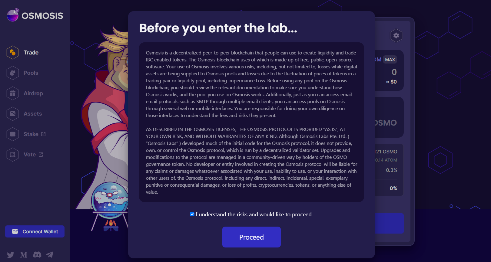

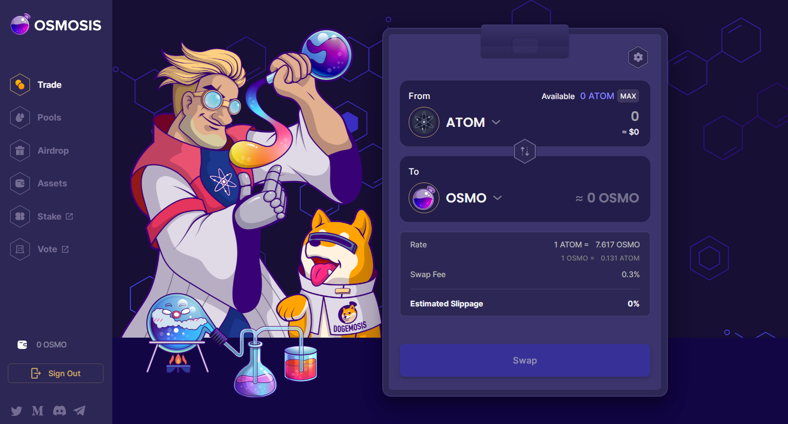

3. Connect your [Keplr](https://www.keplr.app/) wallet to the exchange. If [Keplr](https://www.keplr.app/) wallet window doesn't appear automatically, click on the Keplr button in the Chrome's top right corner and enter your password. How to install Keplr wallet, please see [here](how-to-install-keplr-wallet.md).

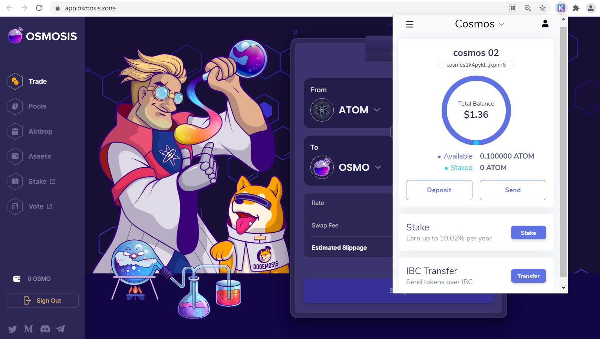

4. Go to "Assets" section of the Osmosis exchange.

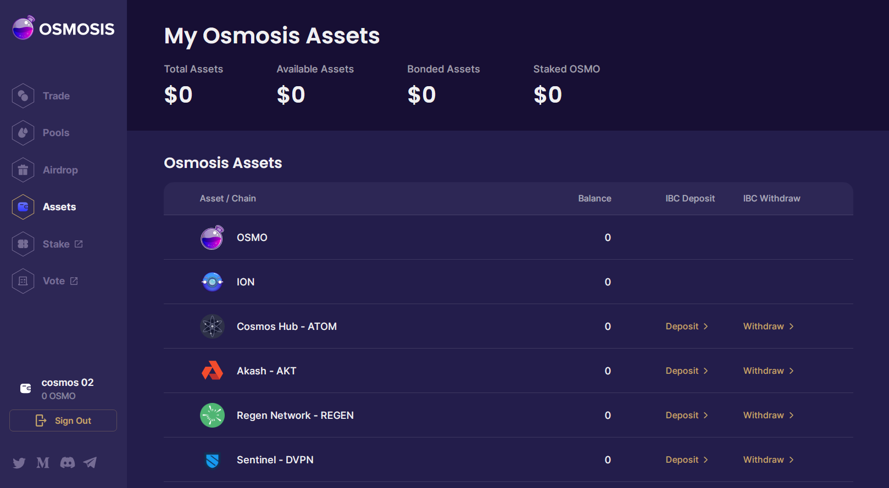

5. Click on "Deposit" button in "Cosmos Hub - ATOM" row. How to buy ATOM and withdraw it to your Keplr wallet, please see [here](how-to-buy-atom-on-centralized-exchange/).

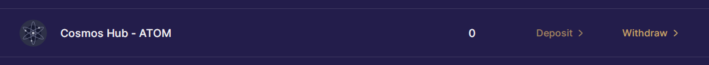

6. Enter an amount of ATOM you want to deposit to the Osmosis exchange. Keep in mind that you need to leave some ATOM in your Keplr wallet for transaction fees in the Cosmos network. Cosmos gas fees vary from from 0.0005 ATOM \(low speed\) to 0.02 ATOM \(high speed\) per one transaction. How to buy ATOM and withdraw it to your Keplr wallet, please see [here](how-to-buy-atom-on-centralized-exchange/).

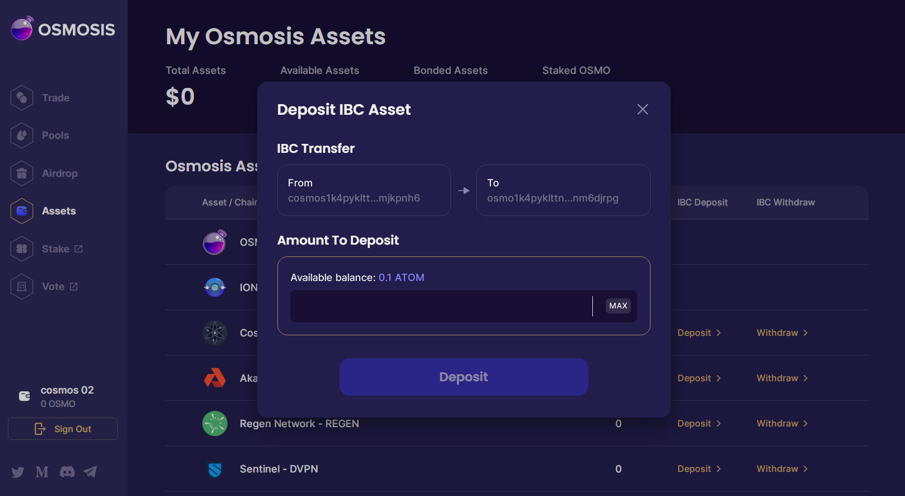

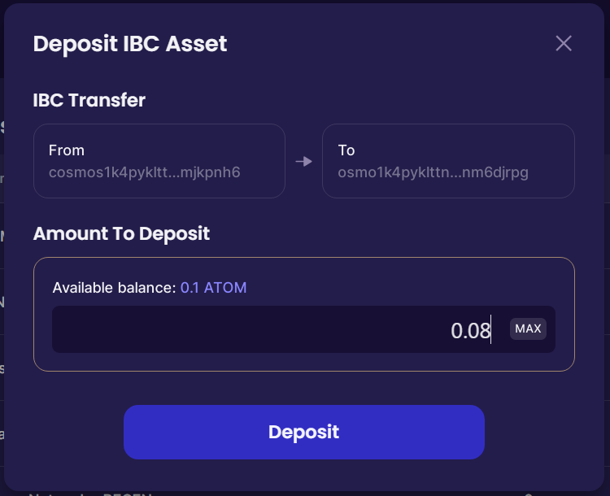

7. Select the gas fee and confirm your deposit in the Keplr wallet. Transaction time for low gas fee is usually 20-60 seconds.

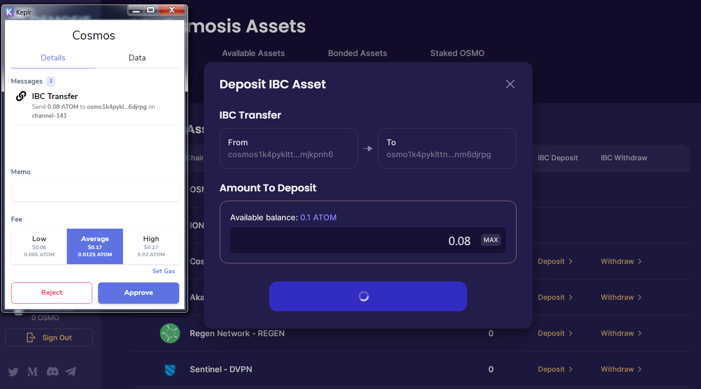

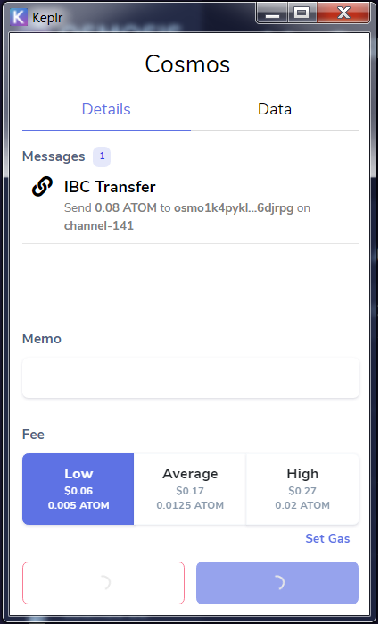

8. Wait until your transaction is processed. You may find details of your transaction in [Mintscan block explorer](https://www.mintscan.io/osmosis) by following the link in "Transaction Hash" column of the Osmosis exchange.

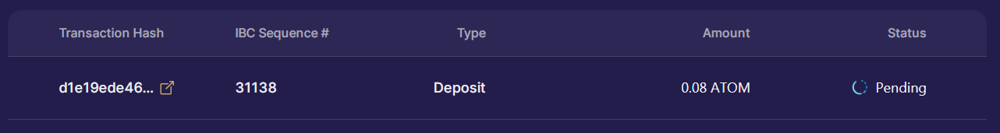

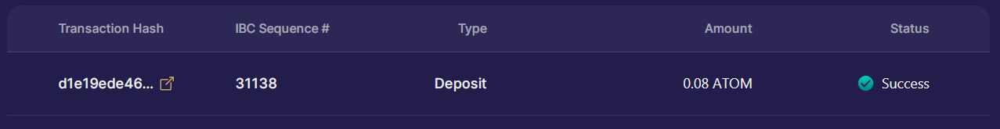

9. If transaction is successfull, you will see your ATOM deposited assets at the top of the exchange user interface.

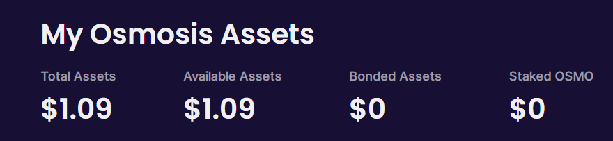

10. To exchange your ATOM coins to OSMO ones, go to "Trade" section and select corresponding tokens in the top and bottom rows.

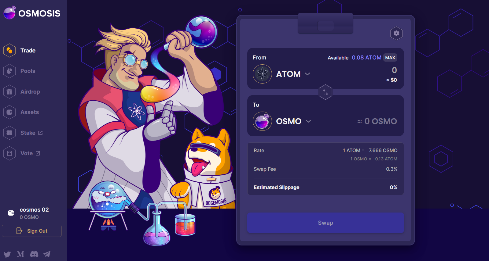

11. Enter an amount of ATOM you want to swap and click on "Swap" button.

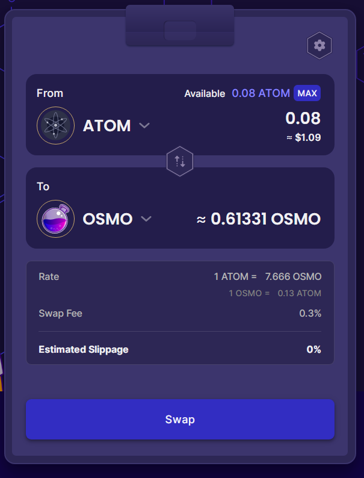

12. If the swap is successful, you will see your OSMO coins in the Keplr wallet.

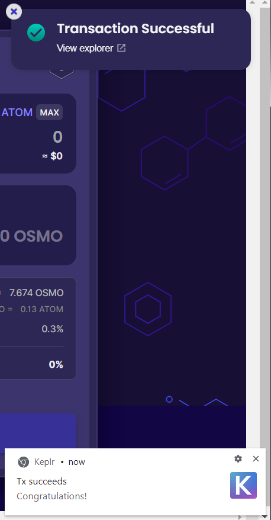

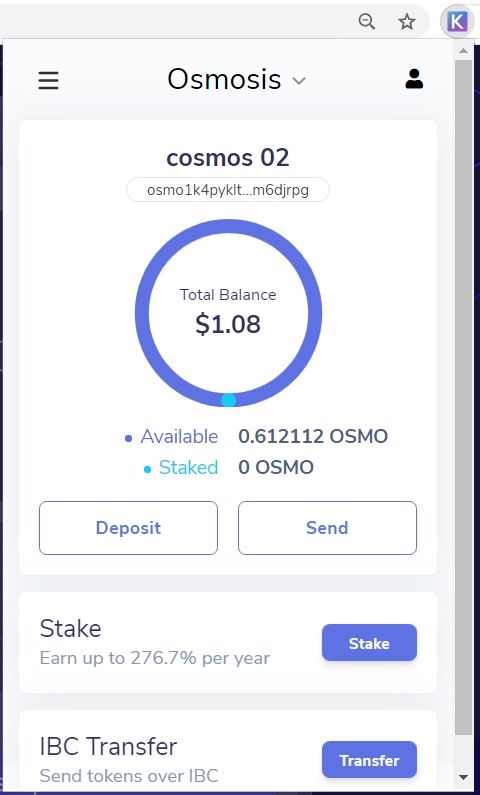

