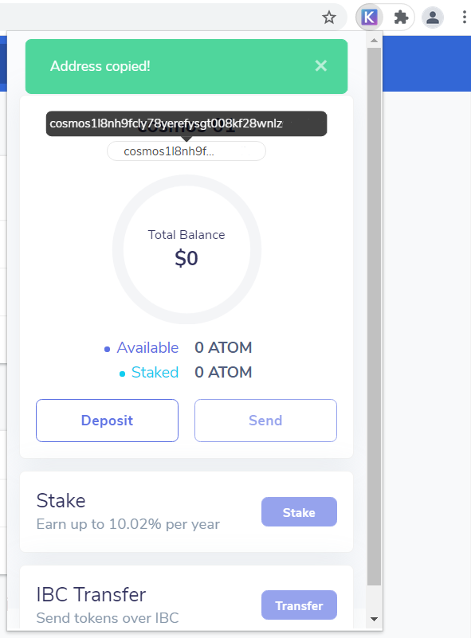

# How to install Keplr wallet

1. Go to [Keplr wallet website](https://www.keplr.app/) using Chrome browser. Unfortunately, other browsers are not supported by Keplr currently.

2. Click on "Install Keplr" button.

3. Click on "Add to Chrome" button. Confirm adding to Chrome.

4. Click on "Extensions" button at the top right corner of Chrome browser and select Keplr.

5. Copy your mnemonic seed to a safe place. Several backups are recommended, e. g. paper and digital \(screenshot or file on private passworded USB\) ones.

6. Set account name and password.

7. Enter your mnemonic seed.

8. Keplr account is created successfully.

9. Pin Keplr to your Chrome browser to make it visible at the Crome panel.

10. Click on Keplr logo on the Chrome top right panel. Wallet is opened.

11. Copy your ATOM address by clicking on it. You will deposit ATOM coins to this addres to exchange it for OSMO coins.

12. Then go to a centalized exchange to buy ATOM tokens. You will find a corresponding guide below \([OKex](https://www.okex.com/join/2995542) exchange\).

