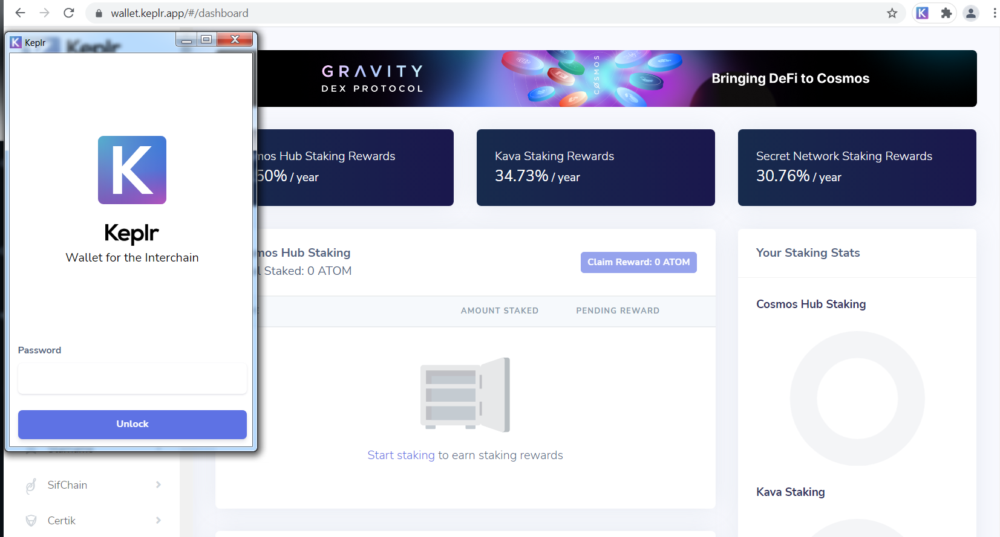

# How to stake Osmosis using Keplr application

1. Go to Keplr app website.

2. Connect your Keplr wallet by entering password.

3. Go to "Osmosis --&gt; Stake" section on the left pane.

4. Choose a validator from the list and click "Manage".

5. Enter amount of OSMO to delegate and click "Delegate"

