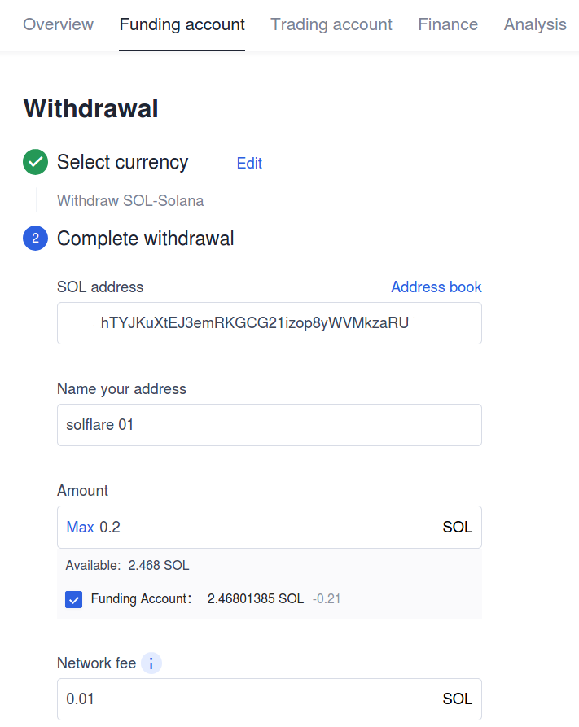
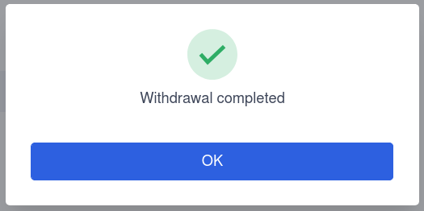

# How to buy Solana on OKEx centralized exchange

## How to create OKEx account

1. Sign up to [OKEx website](https://www.okex.com/join/2995542). 

2. Create an OKEx account. OKEx doesn't have mandatory KYC at the moment.

## How to deposit funds to OKEx

1. Click on "Assets" tab.

2. Click on "Deposit" blue button.

3. Click on "Select currency".

4. Select an asset you want to deposit by scrolling the list or typing into the field. Solana is traded in a pair with the stabelcoin USDT, so the fastest way to buy it is to make a deposit in USDT. But if you have another asset, you can make a deposit with it, then exchange it into USDT using the [OKEx](https://www.okex.com/join/2995542) terminal. There are two subguides below: how to buy SOL with USDT and how to buy SOL with another asset.

## How to buy SOL with USDT

1. Select USDT as depositing asset and choose a network: Ethereum \(ERC-20\), TRON \(TRC-20\) or OKExChain. Make sure you choose the network that transfers your stabelcoin, otherwise the funds just won't come.

2. Confirm [OKEx](https://www.okex.com/join/2995542) warning.

3. Copy your USDT address and send your USDT funds to it.

4. When the USDT funds arrive, click on the three dots in the USDT section of your Funding account, select "Transfer" and move the funds into the Trading account to buy Solana for USDT.

5. Go to the Trading account and click on "Trade" blue button.

6. Click on the "BTC/USDT" option and enter "SOL" into an asset search field.

7. In the SOL/USDT window of the terminal, click on the "Market" option. This provides the option to buy SOL quickly and at market price.

8. When Market section is opened, enter an amount of USDT for wich you want to buy SOL.

9. Click "Buy" button. Check filling of your order in the Order history section at the bottom of the terminal. 

## How to buy SOL depositing another asset

To buy SOL with another asset \(e. g. BTC, ETH, XRP, MATIC\), you need to deposit this asset first the same way you deposit USDT, then exchange an asset to the USDT and exchange USDT for SOL.

## How to withdraw SOL from OKEx

1. Get back to your trading account and check the SOL balance. To withdraw SOL to the external wallet, click on the three dots in the "Action" column of your Trading account, select "Transfer" and move the funds into the Funding account to withdraw Solana to the external wallet and then stake. 

2. Enter the amount you want to transfer into the "Amount" field. Click on "Transfer all" if you want to withdraw all your Solana from the exchange.

When transfer is successful, the balance of your Trading account will be reduced by the amount you moved to the Funding account.

3. Click on the three dots in the SOL section of your Funding account and select "Withdraw" option.

4. Enter your [SolFlare](https://solflare.com) wallet address or another wallet address you want to stake from, enter a custom address title \(optional\) and amount of SOL you want to withdraw. You can enter small amount of SOL first to be ensured that the withdrawal operates fine, then to withdraw remaining major part of SOL.

5. Enter your funds password, e-mail verification and sms codes you set up at the time of registration, then click confirm button.

6. When your withdrawal request is approved by [OKEx](https://www.okex.com/join/2995542), you will receive your SOL to your external wallet.



