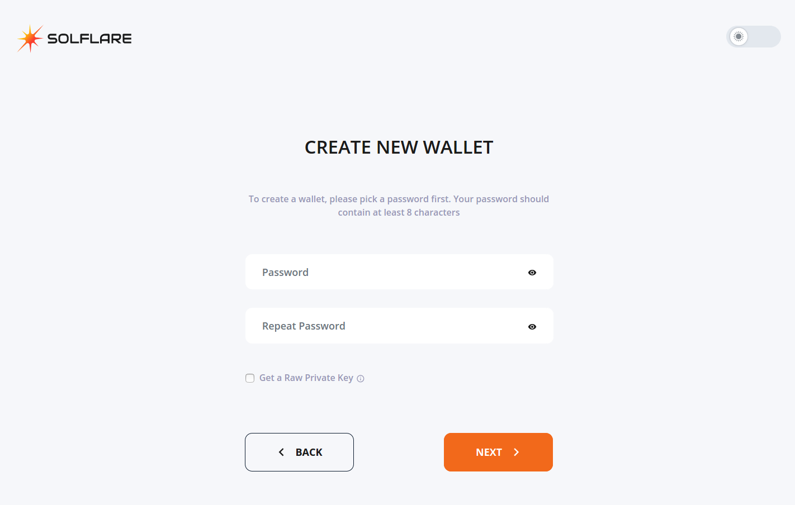
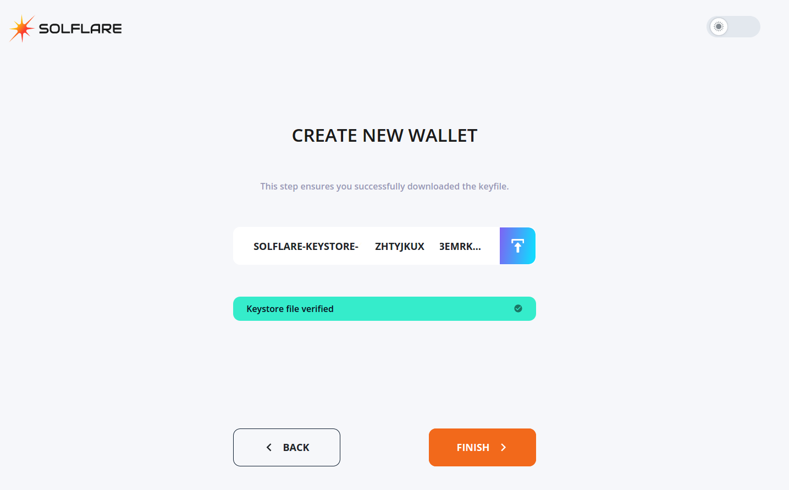
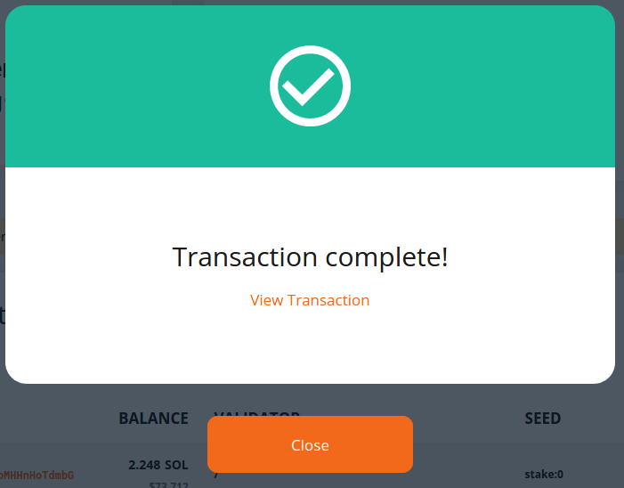

# How to stake Solana using SolFlare browser wallet

1. Go to [solflare.com](https://solflare.com) website.

2. Click on "Create a wallet". If you want to stake with Ledger, please see the [corresponding guide](how-to-stake-solana-using-ledger-and-solflare-browser-wallet.md).

3. Keep "Using Keystore File" tab open and click "Next".

4. Set a solid password and click "Next".

5. Check a checkmark below the "DOWNLOAD KEYSTORE FILE" caption and click on blue button to the right of the caption. Save the keystore file to a location only you have an access. For security enhancing, store the file in two places on different devices. There is no way to access the wallet without this file.

6. Click on the blue button to the right of "UPLOAD KEYSTORE FILE" caption and upload the file.

7. After the keystore file is verified, click on "Finish".

8. Click on "Access" on the Access Wallet screen.

9. The wallet is opened. Click on the button to the right of your SOL address section to copy one. 

10. Deposit SOL funds you want to stake to this address. You may deposit small amount of funds first to be ensured that everything is fine, and then to deposit remaining part. How to make a deposit from the balance of a centralized exchange, please see the [corresponding guide](../how-to-buy-solana-on-centralized-exchange/how-to-buy-solana-on-okex.com-centralized-exchange.md).

11. After successful deposit, you will see your SOL funds in the "Balance" section. 

12. Click on "Get started" at the bottom of screen.

13. Enter an amount of SOL funds you want to stake. Keep in mind that you need a small amount of Solana to cover the cost of fees. The fee per transaction ranges from about 0.000005 SOL to 0.01 SOL. If you do not intend to use the wallet much, 0.1 SOL for fees is enough.

14. Enter the password to confirm transfer of the funds to staking account.

15. Following the transaction confirmation window, the account creation confirmation window will appear.

16. To check the transaction details in the block explorer, click on "View Details". Or just click on "Finish" to get back into your wallet.

17. The balance of your wallet is reduced because of funds transfer to staking account. Click on "Staking" on the top pane.

18. You can observe your funds for staking in the "Your staking accounts" section. To delegate funds, click on "DELEGATE NOW". 

19. Enter your validator's title into the search field. If you would like to stake Mina with us, you are welcome to choose [Staketab](https://staketab.com) provider.

20. When the validator's logo and title appears below the search field, click on it. The green checkmark will light up. Then click on "Next".

21. Confirm delegation with your password.

22. When delegation is successful, notification window will appear. Your delegation will become active with the start of a new epoch in the Solana blockchain. The epoch in Solana blockchain is approximately two days. You can check how much time is remaining until the new epoch on the main page of the [blockchain explorer](https://solanabeach.io).

