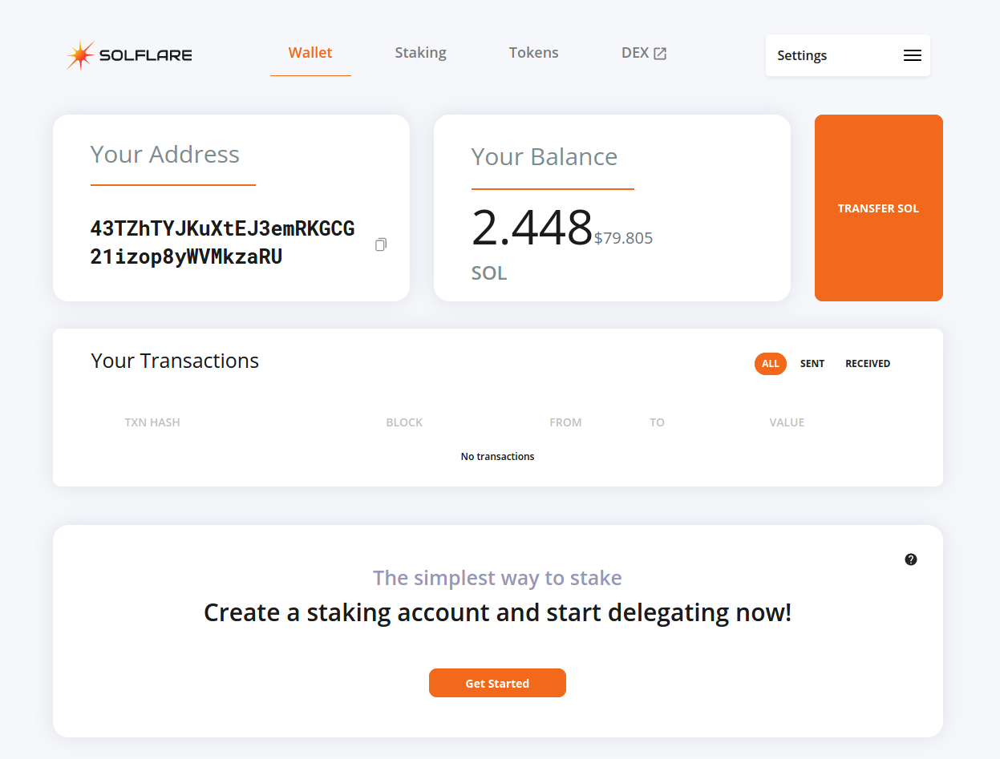
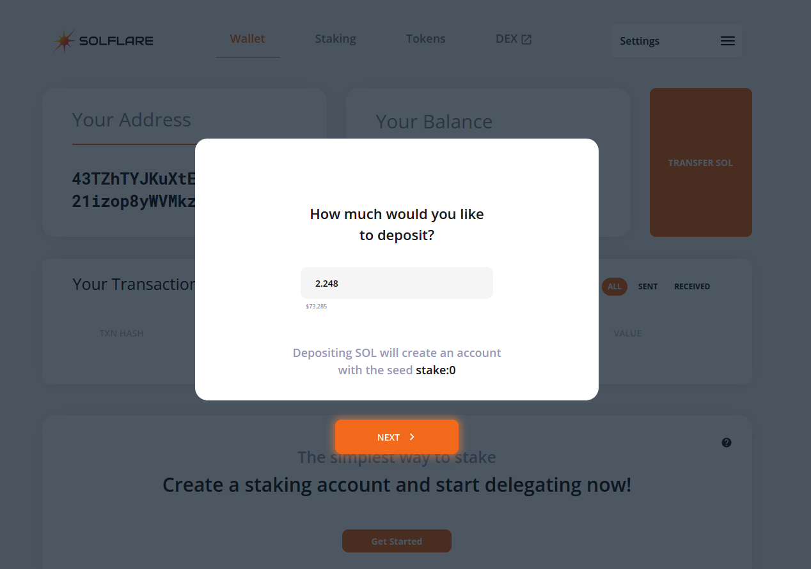
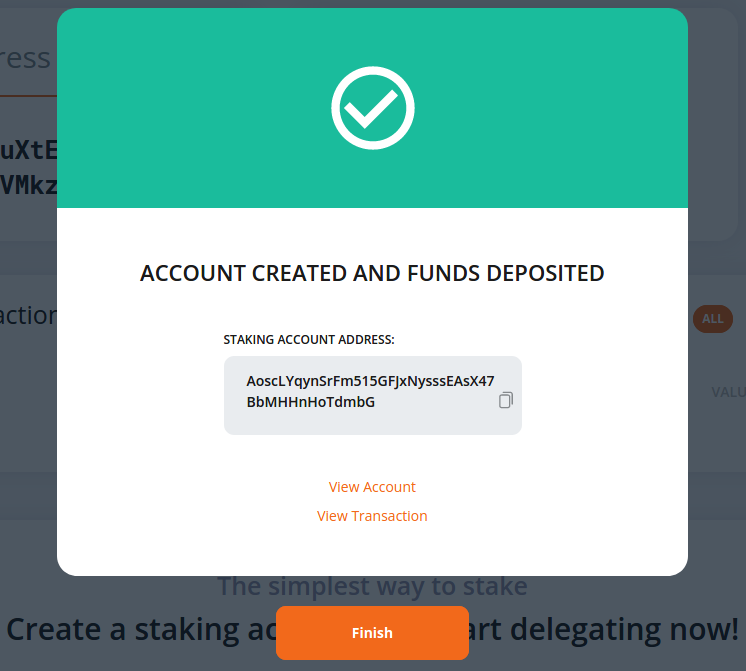
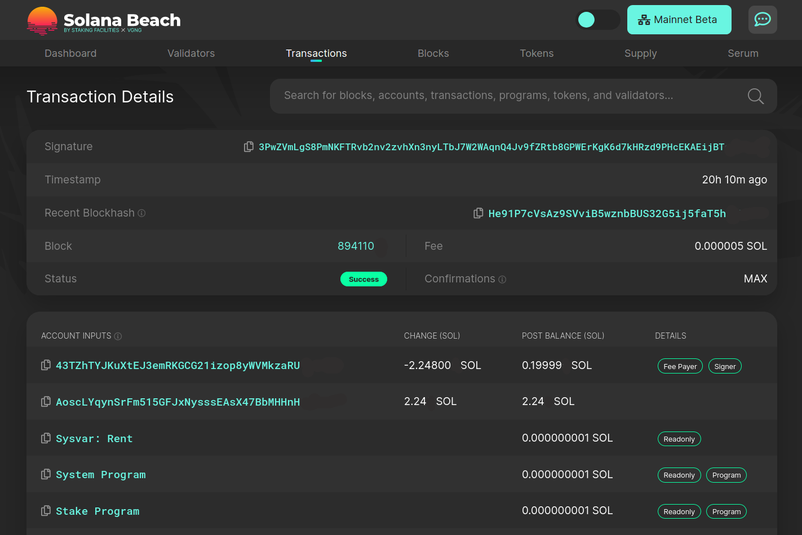
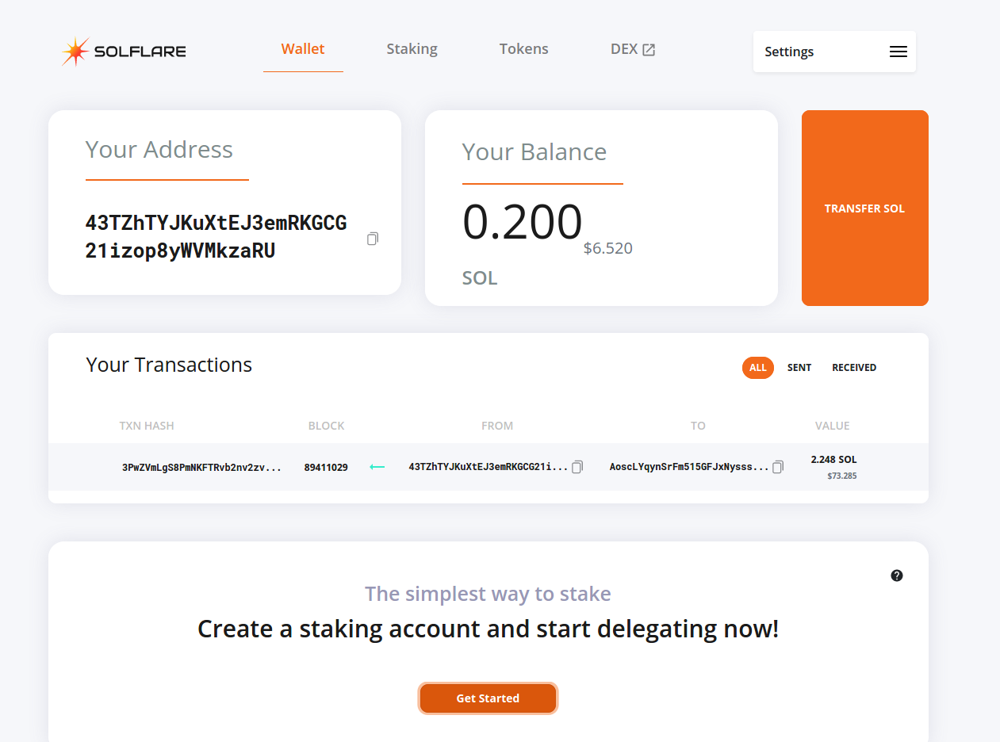
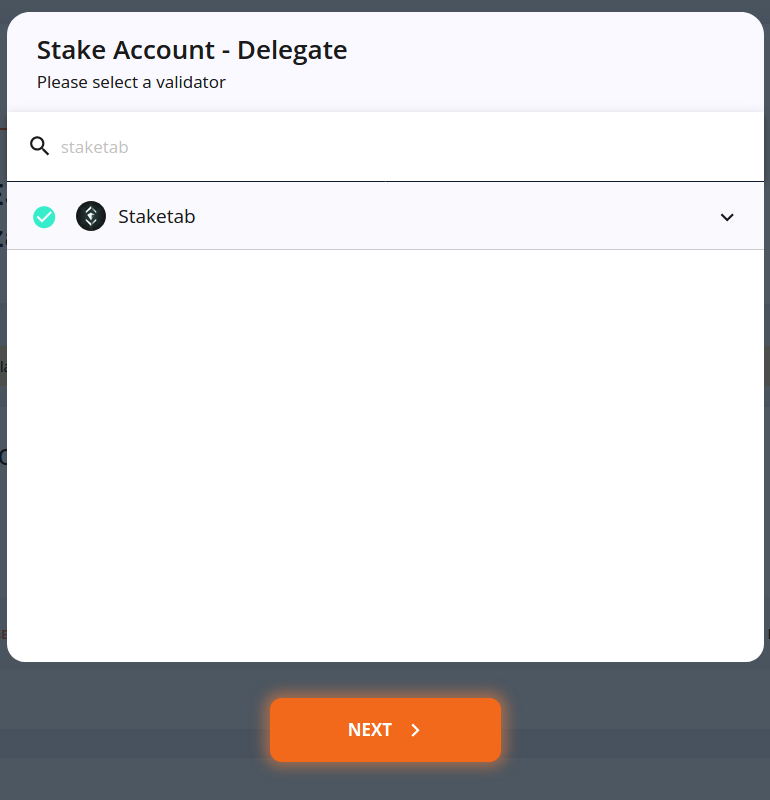
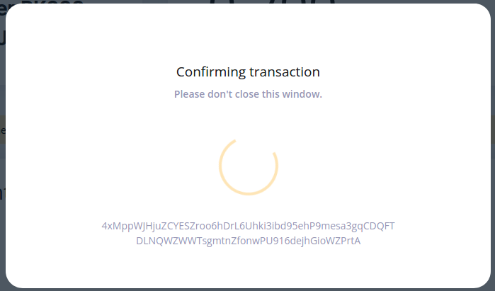

# How to stake Solana using Ledger and SolFlare browser wallet

1. Go to [solflare.com](https://solflare.com) website.

2. Click on "Create a wallet". 

3. Open "Using Ledger Nano S \| Nano X" tab and click "Next".

4. Select a derivation path.

5. Connect your Ledger hardware wallet to PC and authorize it.

6. Select a SOL address of your Ledger from whish you want to delegate your Solana funds. Then click on "Access".

7. The wallet is opened. Click on the button to the right of your SOL address section to copy one.

8. Deposit SOL funds you want to stake to this address. You may deposit small amount of funds first to be ensured that everything is fine, and then to deposit remaining part. How to make a deposit from the balance of a centralized exchange, please see the [corresponding guide](../how-to-buy-solana-on-centralized-exchange/how-to-buy-solana-on-okex.com-centralized-exchange.md).

9. After successful deposit, you will see your SOL funds in the "Balance" section. 

10. Click on "Get started" at the bottom of screen.

11. Enter an amount of SOL funds you want to stake. Keep in mind that you need a small amount of Solana to cover the cost of fees. The fee per transaction ranges from about 0.000005 SOL to 0.01 SOL. If you do not intend to use the wallet much, 0.1 SOL for fees is enough.

12. Confirm the transaction on your Ledger.

13. Following the transaction confirmation window, the account creation confirmation window will appear.

14. To check the transaction details in the block explorer, clickon "View Details". Or just click on "Finish" to get back into your wallet.

15. The balance of your wallet is reduced because of funds transfer to staking account. Click on "Staking" on the top pane.

16. You can observe your funds for staking in the "Your staking accounts" section. To select a validator to which you will delegate SOL funds, scroll down and check "Validators" section.

17. To delegate funds, click on "DELEGATE NOW" in the "Your staking accounts" section. 

18. Enter your validator's title into the search field. If you would like to stake Mina with us, you are welcome to choose StakeTab \([https://staketab.com](https://staketab.com)\) provider.

19. When the validator's logo and title appears below the search field, click on it. The green checkmark will light up. Then click on "Next".

20. Confirm delegation on your Ledger.

21. When delegation is successful, notification window will appear. Your delegation will become active with the start of a new epoch in the Solana blockchain. You can check how much time is remaining until the new epoch on the main page of the [blockchain explorer](https://solanabeach.io).

